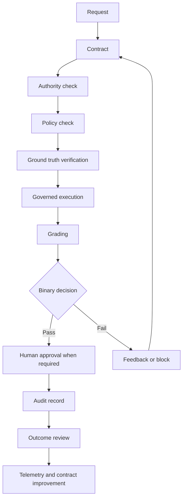
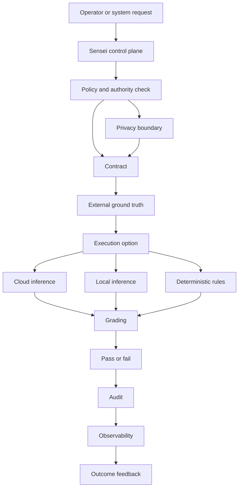

<div align="center">

# HaleES Architecture Specification


**Governed operational intelligence for systems where a useful answer is not the same thing as a trusted action.**

<p align="center">
  <a href="https://github.com/FatherHale/HaleES-Architecture/blob/main/LICENSE.md">
    
  </a>
  
  
  
  
</p>

</div>

> [!IMPORTANT]
> HaleES starts with governance, not generation. This repository shares the public contract, grading, privacy, observability, failure case, HaleES-56 hospitality agent architecture, and governance pattern. The production Sensei OS runtime stays closed.

## HaleES System Plan


This map shows the HaleES platform plan across sources, Sensei OS control, store runtime, persistence, integrations, and operating domains.

It is a system plan, not a production-complete component claim.

## Front Door

| Need | Start here |
| --- | --- |
| Read the visual whitepaper | [Whitepaper Reader](whitepaper/README.md) |
| Read the complete archive | [Full Whitepaper Archive](FULL_WHITEPAPER.md) |
| Study the 56-agent hospitality architecture | [HaleES-56 Hospitality Agent Architecture](HALEES_56_HOSPITALITY_AGENT_ARCHITECTURE.md) |
| Browse the public agent registry | [HaleES-56 Agent Registry](agents/README.md) |
| Run the public demo loop | [Quickstart](QUICKSTART.md) |
| See HaleES block a bad action | [Failure Case: Labor Cut](examples/failure-case-labor-cut.md) |
| Understand contracts | [Contract Spec](CONTRACT-SPEC.md) |
| Understand scoring | [Grading Rubric](GRADING-RUBRIC.md) |
| Understand enforcement telemetry | [Observability And Enforcement Telemetry](docs/observability.md) |
| Understand rule governance | [Managing Enforcement Rules At Scale](docs/rule-management.md) |
| Understand grader trust | [Grader Reliability](GRADER_RELIABILITY.md) |
| Understand model and tool control | [Model, Tool, And Orchestration Governance](MODEL_TOOL_AND_ORCHESTRATION_GOVERNANCE.md) |
| Understand what stays closed | [Public Boundary](PUBLIC_BOUNDARY.md) |
| See public examples | [Examples](examples) |
| Run shape checks | [Validators](validators) |
| Inspect JSON Schemas | [Schemas](schemas) |
| See where the spec is going | [Spec Evolution](SPEC_EVOLUTION.md) |

## What This Is

HaleES is a public architecture specification for governed operational intelligence.

A useful answer can still be unsafe to trust. HaleES treats that as the starting point.

| Public pattern | Meaning |
| --- | --- |
| Contract driven work | The task is defined before execution begins |
| Dual layer grading | 0 to 100 evaluates, 0 or 1 decides |
| Policy and authority checks | Capability does not equal permission |
| External ground truth | Stale or missing data can block acceptance |
| Observability | Enforcement events become telemetry, not dead logs |
| Rule management | Business rules can scale without hard coding every change |
| HaleES-56 agent architecture | Hospitality work is mapped into governed specialist capability profiles |
| Local first and cloud capable inference | Intelligence can run where the task needs it |
| Privacy boundaries | Context is governed before it is used |
| Auditability | Decisions should be explainable after the fact |
| Outcome review | Decisions are evaluated after they enter the operation |

The private product runtime is not published here.

## What You Can Run Today

This repository is not the HaleES runtime, but it includes small public reference tools.

| Runnable piece | Command | Purpose |
| --- | --- | --- |
| Mock contract loop | `python reference/end_to_end_mock_loop.py` | Shows contract, mock execution, dummy grading, decision, feedback, and iteration |
| Contract validator | `python validators/contract_validator.py examples/staffing_recovery_contract.md` | Checks whether a markdown contract has the expected public sections |
| Grading validator | `python validators/grading_validator.py examples/sample_grading_result.json` | Checks whether a grading result has the expected public fields and threshold decision |

> [!TIP]
> The fastest way to understand HaleES is to watch it reject a bad action. Start with [Failure Case: Labor Cut Blocked By Staffing Ratio](examples/failure-case-labor-cut.md).

## Quick Start Failure Case

A public architecture repo should prove the pattern quickly.

The fastest proof is not a perfect success case. The fastest proof is a clear failure case.

| Step | What happens |
| --- | --- |
| 1 | A manager asks HaleES to reduce labor at a luxury property |
| 2 | The agent recommends a financially useful labor cut |
| 3 | The plan drops front desk coverage below the required service ratio |
| 4 | The staffing ratio validator detects the violation |
| 5 | The grading layer lowers the score and returns binary decision `0` |
| 6 | The action is blocked and written to the audit trace |

> [!IMPORTANT]
> HaleES does not only generate recommendations. It governs whether those recommendations are allowed to become action.

## Current Status

This is an early public specification with runnable reference material.

| Public artifact | What it does | What it is not |
| --- | --- | --- |
| [Whitepaper Reader](whitepaper/README.md) | Presents the whitepaper as a visual multi-part reader | Not the production runtime |
| [Full Whitepaper Archive](FULL_WHITEPAPER.md) | Preserves the complete long-form paper in one file | Not the production runtime |
| [HaleES-56 Hospitality Agent Architecture](HALEES_56_HOSPITALITY_AGENT_ARCHITECTURE.md) | Defines 56 governed hospitality agent profiles, clusters, boundaries, and public workflow examples | Not internal prompts, production orchestration, or live customer logic |
| [HaleES-56 Agent Registry](agents/README.md) | Provides public cluster files for the 56 specialist profiles | Not private agent prompts or runtime instructions |
| [Mock loop](reference/end_to_end_mock_loop.py) | Shows contract, mock execution, dummy grading, decision, feedback, and iteration | Not the production runtime |
| [Failure cases](examples/failure-case-labor-cut.md) | Shows bad actions being blocked | Not live customer logic |
| [Validators](validators) | Check public contract and grading result shape | Not the production grader |
| [Validator specs](validators/staffing-ratio-validator.md) | Explain how hard constraints should fail unsafe actions | Not private enforcement code |
| [JSON Schemas](schemas) | Define public JSON shapes | Not the private schema system |
| [Examples](examples) | Show public safe scenarios | Not customer data or runtime logic |
| [Reliability notes](GRADER_RELIABILITY.md) | Explain public grader trust questions | Not private scoring implementation |
| [Observability notes](docs/observability.md) | Explain telemetry around enforcement events | Not production telemetry infrastructure |
| [Rule management notes](docs/rule-management.md) | Explain scalable policy ownership | Not the private admin console |

> [!TIP]
> Start with `agents/README.md` for the cluster registry, `HALEES_56_HOSPITALITY_AGENT_ARCHITECTURE.md` for the agent operating map, `whitepaper/README.md` for the visual reader, or `python reference/end_to_end_mock_loop.py` if you want to see the loop move instead of only reading about it.

## What Stays Closed

| Closed area | Why it stays closed |
| --- | --- |
| Production Sensei OS runtime | Commercial product engine |
| Private grader | Core reliability implementation |
| Internal agent prompts | Private operating instructions and runtime behavior |
| Model routing | Operational routing logic |
| Tool routing | Execution authority logic |
| Orchestration budgets | Internal safety and cost controls |
| Memory boundaries | Private data governance implementation |
| Marketplace enforcement | Commercial enforcement layer |
| Hosted infrastructure | Deployment and operations layer |
| Private datasets | Customer and operational data |

This boundary is intentional. The public specification explains the pattern. The private runtime remains the machine.

## License and Commercial Boundary

The public architecture materials in this repository are licensed under Apache-2.0.

| Public under Apache-2.0 | Requires separate HaleES agreement |
| --- | --- |
| Architecture specification | Production Sensei OS runtime |
| Public examples and mock loops | Proprietary grader implementation |
| Public schemas and validators | Live integrations and production adapters |
| Public diagrams and documentation | Hosted infrastructure and deployment systems |
| Public governance pattern | Commercial runtime workflows and private policies |
| Public HaleES-56 agent architecture | Internal prompts, proprietary execution logic, and runtime implementation |

Commercial teams may study, fork, and build from the public architecture materials under Apache-2.0 terms. Commercial access to the HaleES production runtime, proprietary implementation, partnerships, support, or private deployment work requires a separate agreement with HaleES / Jason Hale.

## Core Concepts At A Glance

| Concept | HaleES stance |
| --- | --- |
| Generation | Useful, but not enough |
| Authority | Must be granted, not assumed |
| Skills | Knowledge, not permission |
| Contracts | Define the work before execution |
| Agent profiles | Specialist capability maps, not unchecked executors |
| Core policy | Can block even high authority users |
| Ground truth | Must be verified before risky actions proceed |
| Grading | Measures whether the output satisfies the contract |
| Binary decision | Creates a clear pass or fail gate |
| Iteration | Improves failed work inside limits |
| Audit | Preserves what happened and why |
| Observability | Shows where enforcement blocks, learns, and improves |
| Outcome review | Feeds real consequences back into future contracts |

> [!NOTE]
> Most agent frameworks chase flexibility. HaleES is built for survival in real operations.

## Public Flow Diagram



## Public Component View



## The Operating Problem

| Common failure | HaleES response |
| --- | --- |
| A model gives a plausible answer | The answer still has to pass the contract |
| A tool can act | The tool still needs authority |
| A high authority user violates hard policy | Constitutional rules can still block the action |
| A vendor system is unavailable | Ground truth checks can pause or fail acceptance |
| A workflow retries forever | Iteration stays bounded |
| A score looks confident | Confidence stays separate from pass or fail |
| A manager rubber stamps approvals | Operational drift monitoring can raise review level |
| A decision passes but causes damage later | Outcome review feeds the consequence back into future contracts |
| Cloud inference is unavailable or inappropriate | Local or deterministic paths can still matter |
| Private data could leak across contexts | Privacy boundaries stay part of execution authority |

HaleES is not a chatbot for hospitality. It is a governed operational intelligence layer where models, local inference, deterministic rules, human approvals, agent profiles, and audited execution work inside one control system.

## Enforcement Telemetry

| Signal | Why it matters |
| --- | --- |
| Blocked actions | Shows where agents attempt unsafe or unauthorized work |
| Failed grading | Shows where outputs miss contract requirements |
| Missing ground truth | Shows where external dependency checks are unreliable |
| Policy conflicts | Shows where role authority collides with hard policy |
| Fast approvals | Shows possible approval fatigue or rubber stamping |
| Outcome failures | Shows where approved decisions failed in the real operation |

> [!NOTE]
> Enforcement events should become operating intelligence. A blocked action is not only a denial. It is a signal.

## Local First, Cloud Capable Intelligence

| Path | Public purpose |
| --- | --- |
| Cloud inference | Heavier reasoning, long context analysis, research, cross property coordination |
| Local or device level inference | Lower latency work, privacy sensitive workflows, offline continuity, site support |
| Deterministic execution | Rules, scores, constraints, schemas, queues, and approved tools |

This makes HaleES model flexible rather than model dependent.

The model is one reasoning surface inside a governed operating system, not the whole product.

## Privacy First Data Boundary

| Principle | Meaning |
| --- | --- |
| Minimum necessary context | Only the context needed for the task should be available |
| Governed memory boundaries | Personal, organizational, and cross organization intelligence stay separated by permission |
| Pattern learning without exposure | Shared intelligence improves through generalized patterns, not private data leakage |

Privacy, permission, and execution authority belong in the same governance layer.

## Skills Are Knowledge, Not Authority

> [!IMPORTANT]
> A skill, prompt, model, tool, workflow, or agent profile does not gain permission just because it exists or can execute.

In HaleES, authority must come from governance signals such as verified identity, applicable policy, risk classification, approval requirements, and audited execution context.

Many failures are not failures of generation. They are failures of authorization.

## Sensei As Control Plane

| Part | Public role |
| --- | --- |
| Models | Specialists |
| Agent profiles | Capability maps and routing domains |
| Tools | Governed capabilities |
| Contracts | Work definition |
| Grading | Acceptance check |
| Authority boundary | Decision control |
| Observability | Enforcement telemetry and improvement signals |
| Outcome review | Post execution consequence feedback |

Sensei is not one model, one chat screen, one route, or one button.

Sensei is the governance and orchestration control plane.

## Dual Layer Grading

| Layer | Purpose |
| --- | --- |
| 0 to 100 score | Evaluates accuracy, efficiency, constraint adherence, quality, and timeliness |
| 0 or 1 decision | Decides whether the output passes the threshold |
| Confidence | Tracks certainty separately from pass or fail |
| Feedback | Guides the next iteration when the result fails |
| Outcome signal | Evaluates whether the accepted action worked after execution |

No decision exists without scoring. No scoring matters without a decision.

## Contract Driven Loop

| Step | What happens |
| --- | --- |
| 1 | The orchestrator creates a contract with objective, constraints, acceptance criteria, and expected output shape |
| 2 | The agent, model, or tool executes against that contract |
| 3 | The system checks authority, policy, and ground truth |
| 4 | The system grades the output |
| 5 | A passing result can move to approval or finalization |
| 6 | A failing result receives feedback, blocks, or iterates |
| 7 | Iteration stops at the configured limit |
| 8 | Approved actions are audited and reviewed after execution |

Generation alone never finalizes work. Acceptance is governed.

## Sample Public Contract Snippet

```markdown
# Contract

Objective
Create a same day staffing recovery plan for a missed shift.

Authority boundary
The output may recommend actions, but it may not directly change the schedule or contact employees without approval.

Required output
1. Situation summary.
2. Coverage risk.
3. Recovery options.
4. Recommended option.
5. Escalation trigger.

Acceptance criteria
1. The plan identifies the uncovered role and time window.
2. The plan provides at least two recovery options.
3. The plan respects role permission and labor constraints.
4. The plan explains when a manager should intervene.

Decision threshold
Global score must be 85 or higher.
```

## Public Examples And Reference Material

| Resource | What it shows |
| --- | --- |
| [HaleES-56 Hospitality Agent Architecture](HALEES_56_HOSPITALITY_AGENT_ARCHITECTURE.md) | 56 governed hospitality agent profiles and public-safe workflow examples |
| [HaleES-56 Agent Registry](agents/README.md) | Public cluster files for each governed agent domain |
| [Failure case: labor cut](examples/failure-case-labor-cut.md) | A financially useful recommendation blocked by a hard staffing ratio |
| [Failure case: policy conflict](examples/failure-case-policy-conflict.md) | High authority request blocked by constitutional policy |
| [Failure case: missing ground truth](examples/failure-case-missing-ground-truth.md) | Recommendation paused because vendor data is unavailable |
| [Staffing recovery](examples/staffing_recovery_contract.md) | Speed and operational clarity |
| [Privacy sensitive guest recovery](examples/privacy_sensitive_guest_recovery.md) | Minimum necessary context |
| [Cross property coordination](examples/cross_property_coordination.md) | Pattern learning without private data exposure |
| [Non hospitality incident response](examples/non_hospitality_incident_response.md) | The same authority pattern outside restaurants |
| [Rubric samples](examples/rubric_pass_and_fail_samples.md) | Public pass and fail reasoning |
| [Sample contract JSON](examples/sample_contract.json) | Public contract shape |
| [Sample grading result JSON](examples/sample_grading_result.json) | Public grading result shape |
| [Mock loop](reference/end_to_end_mock_loop.py) | Runnable local demonstration |
| [Observability](docs/observability.md) | Telemetry around enforcement events |
| [Rule management](docs/rule-management.md) | How operating rules scale without hard coding every change |
| [Staffing ratio validator](validators/staffing-ratio-validator.md) | Public hard constraint validator spec |
| [Policy conflict validator](validators/policy-conflict-validator.md) | Public constitutional policy validator spec |

## Adoption Path

| Use case | Public safe path |
| --- | --- |
| Learn the pattern | Read the contract, grading, and HaleES-56 docs |
| Test the shape | Run validators against examples |
| See the loop | Run the mock Python script |
| Watch a failure case | Read the labor cut failure example |
| Build around the public spec | Use the schemas and examples |
| Discuss the architecture | Open issues without private data or runtime details |

The open specification shares the principle. The private HaleES runtime remains the machine.

## How HaleES Differs From Flexibility First Frameworks

| Dimension | Flexibility first pattern | HaleES pattern |
| --- | --- | --- |
| Main goal | Capability and experimentation | Governed execution |
| Agent design | Generic personas or prompt chains | Hospitality-specific capability profiles |
| Authority | Often prompt driven | Explicitly bounded |
| Acceptance | Informal or reviewer based | Contract and grading based |
| Retry behavior | Can drift or loop | Bounded iteration |
| Privacy | Often provider or app level | Part of execution authority |
| Models | Often the center | One reasoning surface inside the system |
| Tools | Capability first | Permission first |
| Audit | Variable | Part of the pattern |
| Observability | Often secondary | Enforcement telemetry is part of governance |
| Rule management | Often code or prompt based | Business policy layer with audit trails |
| Outcome feedback | Often absent | Consequences feed future contracts |

This is not a claim that every other framework is wrong. It is a different design objective.

## Public Specification Boundary

| Included publicly | Remains proprietary |
| --- | --- |
| Contract format | Sensei OS production runtime |
| HaleES-56 agent names and responsibilities | Internal prompts and private runtime instructions |
| Grading rubric | Closed source grader implementation |
| Public examples | Model routing implementation |
| JSON samples and schemas | Local and cloud inference routing implementation |
| Shape validators | Private memory boundary implementation |
| Grader reliability notes | Command and execution engine |
| Observability pattern | Production telemetry implementation |
| Rule management pattern | Private admin and policy UI |
| Failure case examples | Live customer enforcement logic |
| Mock loop | Marketplace enforcement engine |
| Governance principles | Production deployment systems |

## Patent Pending Notice

Patent pending. A provisional patent application covering the grading and orchestration system was filed in November 2025.

This notice is provided for transparency about the architecture direction and does not claim a granted patent.

## Closing Statement

> [!IMPORTANT]
> Governance is not something added after generation. Governance is the system.

| HaleES separates | Because |
| --- | --- |
| Knowledge from authority | Knowing is not permission |
| Output from acceptance | Generation does not equal trust |
| Agent profile from execution authority | Expertise does not grant permission |
| Score from decision | Nuance and execution need different layers |
| Confidence from pass or fail | Certainty should not erase review needs |
| Authority from core policy | Rank does not erase hard boundaries |
| Approval from outcome | A decision is proven after it enters the operation |
| Public specification from private runtime | The pattern can be shared without exposing the engine |

HaleES exists for organizations that need reliable and auditable execution instead of best effort autonomy.

The goal is not less intelligence.

The goal is intelligence that can be trusted in production.
