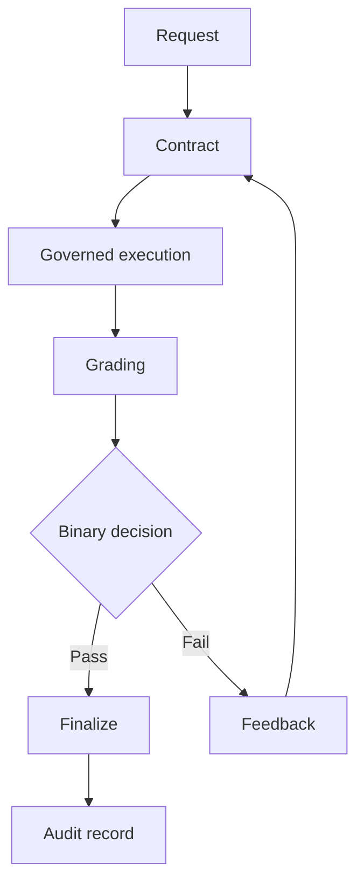
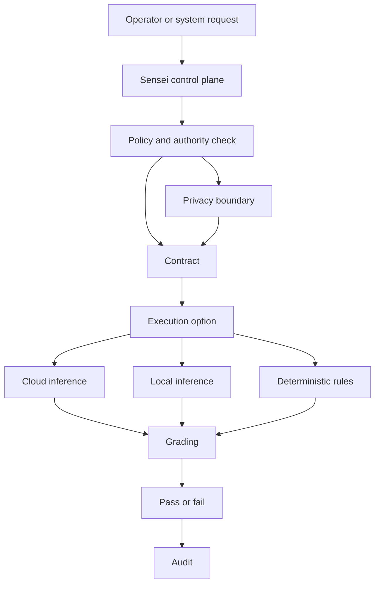

# HaleES Architecture Specification


## What This Is

HaleES is a public architecture specification for governed operational intelligence.

The core idea is simple. A system can generate a useful answer and still be unsafe to trust.

HaleES starts with governance, not generation.

This repository explains the public pattern behind contract driven execution, dual layer grading, local first and cloud capable inference, privacy boundaries, model governance, tool governance, orchestration governance, and auditable authority.

The production HaleES runtime is closed. This repository explains the principle, not the private machine.

## Current Status

This is an early public architecture specification.

The contract format, grading rubric, examples, diagrams, JSON samples, reliability notes, simple validators, and mock loop are public reference material.

The validators check public shape only. They are not the HaleES production grader.

The mock loop shows contract, mock execution, mock grading, decision, feedback, and iteration. It is not the HaleES production runtime.

The examples are public safe scenarios. They do not expose private customer data, private routing, private memory, private infrastructure, or commercial product code.

## Start Here

1. Read this README for the high level architecture.
2. Read CONTRACT SPEC for the public contract format.
3. Read GRADING RUBRIC for the 0 to 100 score and 0 or 1 decision pattern.
4. Read GRADER RELIABILITY for the public reliability questions around scoring, review, and gaming.
5. Read MODEL TOOL AND ORCHESTRATION GOVERNANCE for the public control layer principles.
6. Read PUBLIC BOUNDARY before using or contributing anything from this repo.
7. Review the examples folder for public safe scenarios, JSON samples, and broader domain examples.
8. Review the validators folder for simple shape checks.
9. Review the reference folder for the mock end to end loop.
10. Read SPEC EVOLUTION to see where the public spec can grow.

## What Stays Closed

The production Sensei OS runtime remains proprietary.

The private grader, model routing, tool routing, orchestration budgets, memory boundaries, execution engine, marketplace enforcement, hosted infrastructure, private datasets, and commercial HaleES product code are not part of this public repository.

## Core Concepts At A Glance

HaleES starts with governance, not generation.

A request is not trusted just because a model can answer it.

A model, tool, workflow, or skill can know something without having authority to act.

A contract defines the work before execution begins.

A grader scores the result from 0 to 100.

A binary decision accepts or rejects the result.

A failed result can iterate with feedback.

A passed result can move forward through the proper authority boundary.

The audit trail matters because operational intelligence has to explain what happened after the fact.

Most agent frameworks chase flexibility.

HaleES is built for survival in real operations.

## Public Flow Diagram



## Public Component View



## Thesis

In real operations, especially hospitality, the question is not only what an agent can do. The better question is what the agent is allowed to do, under which policy, with what evidence, and how the result is accepted or rejected.

HaleES exists for that gap.

It is not a chatbot for hospitality. It is a governed operational intelligence layer where models, local inference, deterministic rules, human approvals, and audited execution all work inside one control system.

## Why HaleES Exists

Organizations adopting artificial intelligence usually hit the same problem.

1. They can generate outputs quickly.
2. They cannot always govern execution quality.
3. They cannot always prove why a decision passed.
4. They cannot always stop unauthorized or risky behavior from being treated as acceptable work.

In flexible systems, capability often comes before control. In operations, that order is backwards.

HaleES is built for environments where outputs must be bounded by policy, scored against explicit criteria, accepted through a clear threshold, and auditable after execution.

The architecture does not reject model capability. It puts model capability inside authority, privacy, grading, and execution boundaries.

## Local First, Cloud Capable Intelligence

HaleES is designed as a local first, cloud capable hospitality operating system.

The system can use large language models when they are useful, but core operational authority does not depend entirely on a model. HaleES keeps durable structure under the intelligence layer. That structure includes permissions, roles, audit records, execution queues, operational state, grading contracts, tool governance, deterministic business rules, and explicit acceptance gates.

Inference can run in more than one place depending on the job.

1. Cloud inference can support heavier reasoning, long context analysis, research, cross property coordination, and high capability model routing.
2. Local or device level inference can support lower latency work, privacy sensitive workflows, offline continuity, and site specific operational support.
3. Deterministic execution can support work that should be handled by rules, scores, constraints, schemas, queues, or approved tools without needing a model at all.

This makes HaleES model flexible rather than model dependent. The model is one reasoning surface inside a governed operating system, not the whole product.

The goal is operational continuity. If cloud intelligence is available, HaleES can use it. If local inference is better, HaleES can route there. If no model is needed, HaleES can still operate through governed system logic.

## Privacy First Data Boundary

HaleES treats privacy as architecture, not decoration.

Local first intelligence supports this by allowing sensitive operational context to stay closer to the property, device, or organization when cloud processing is not necessary. Inference placement can be selected based on privacy, risk, latency, and operational need.

At a public specification level, HaleES follows three principles.

1. Minimum necessary context. Only the context needed for a task should be available to the model, tool, or workflow doing that task.
2. Governed memory boundaries. Personal, organizational, and cross organization intelligence must stay separated by policy and permission.
3. Pattern learning without exposure. Shared intelligence should improve the system through generalized patterns, not by revealing one organization private data to another.

This means HaleES can learn from operations without treating private operational data as public knowledge. Privacy, permission, and execution authority belong in the same governance layer.

## Core Principle, Skills Are Knowledge, Not Authority

A foundational HaleES principle is simple.

Skills are knowledge. Authority is not automatic.

A skill, prompt, model, tool, or workflow does not gain permission just because it exists or can execute.

In HaleES, authority must come from governance signals such as verified identity, applicable policy, risk classification, approval requirements, and audited execution context.

This matters because many failures are not failures of generation. They are failures of authorization. A system can produce plausible output and still violate process, policy, or operational safety. HaleES separates what a component knows from what it is allowed to do.

## Sensei as Orchestration and Control Plane

Within the HaleES architecture, Sensei is the governance and orchestration control plane.

Sensei is not one model. Sensei is not one chat screen. Sensei is not one route. Sensei is not one button.

Sensei is the control layer that determines which models, tools, workflows, policies, and execution methods may be used in a given operational context.

The public concept is simple.

1. Models are specialists.
2. Tools are governed capabilities.
3. Contracts define requested work.
4. Grading determines whether work passes.
5. Execution only moves forward through authority boundaries.

This keeps orchestration policy aware instead of improvised. Selection and execution are not only capability driven. They are governance driven.

The production Sensei OS runtime remains proprietary. This public repository describes architectural patterns, open contract and grading conventions, and governance principles. It does not expose closed production internals.

## Dual Layer Grading

HaleES evaluates work through a dual layer grading mechanism that combines nuanced scoring with a decisive outcome.

### Layer 1, Gradient Evaluation

Each evaluated output receives category scores from 0 to 100 across five dimensions.

1. Accuracy.
2. Efficiency.
3. Constraint adherence.
4. Quality.
5. Timeliness.

These scores are aggregated into a global score from 0 to 100.

### Layer 2, Binary Decision

A binary acceptance decision is then applied.

1. The binary decision is 1 when the global score is 85 or higher.
2. The binary decision is 0 when the global score is below 85.
3. Confidence is tracked separately from pass or fail.

HaleES treats both layers as necessary.

0 to 100 evaluates.
0 or 1 decides.

No decision exists without scoring. No scoring matters without a decision.

Gradient scoring gives explainability. Binary gating gives operational clarity.

## Contract Driven Loop

HaleES execution follows a contract driven loop.

1. The orchestrator creates a contract with objective, constraints, acceptance criteria, and expected output shape.
2. The agent, model, or tool executes against that contract.
3. The system grades the output using the dual layer rubric.
4. If the binary decision is 1, the result can be finalized.
5. If the binary decision is 0, feedback is appended and the task iterates.
6. The default maximum is five iterations.

This creates disciplined progress toward acceptable output instead of open ended retry behavior.

## Example High Level Flow

A supervisor submits a request to produce a staffing recovery plan for a same day shift gap.

The orchestrator issues a structured contract with required sections, policy boundaries, and constraints.

A selected specialist model or tool produces a draft plan.

The grader scores the draft across the five categories and computes the global score.

If the score is below threshold, the system attaches actionable feedback and runs another iteration.

Once the score reaches threshold, the binary decision flips to pass and the output is finalized for operational use.

Generation alone never finalizes work. Acceptance is governed.

## Sample Public Contract Snippet

```markdown
# Contract

Objective
Create a same day staffing recovery plan for a missed shift.

Authority boundary
The output may recommend actions, but it may not directly change the schedule or contact employees without approval.

Required output
1. Situation summary.
2. Coverage risk.
3. Recovery options.
4. Recommended option.
5. Escalation trigger.

Acceptance criteria
1. The plan identifies the uncovered role and time window.
2. The plan provides at least two recovery options.
3. The plan respects role permission and labor constraints.
4. The plan explains when a manager should intervene.

Decision threshold
Global score must be 85 or higher.
```

## More Public Examples

The examples folder includes public safe scenarios that show how the same pattern can apply in different contexts.

1. Staffing recovery, where the system needs speed and operational clarity.
2. Privacy sensitive guest recovery, where minimum necessary context matters.
3. Cross property coordination, where shared pattern intelligence is useful without exposing one property private data to another.
4. Non hospitality incident response, where the same authority and contract pattern applies outside restaurants.
5. Rubric pass and fail samples, where the scoring and binary decision pattern can be understood without the private production grader.
6. Sample contract JSON and sample grading result JSON, where the public shape can be seen without exposing the production engine.

The reference folder includes a public mock loop that shows a contract being issued, executed against a mock, graded by a dummy scorer, decided, and iterated.

The validators folder includes public safe tools that check shape only. They do not reproduce private HaleES scoring, routing, memory, or execution logic.

## Adoption Path

This public specification is meant to be useful even though the production HaleES runtime remains closed.

People can engage with the open spec in several safe ways.

1. Study the contract format and grading pattern.
2. Use the public examples to structure governed work in their own systems.
3. Run the public validators to check whether a sample contract or grading result has the expected visible shape.
4. Run the public mock loop to see the contract, grading, decision, feedback, and iteration pattern in one simple file.
5. Build small tools that validate whether a contract includes objective, constraints, required output, acceptance criteria, and a decision threshold.
6. Discuss governance patterns through issues without exposing private customer data or runtime internals.
7. Compare the pattern against flexibility first frameworks to understand where authority, privacy, audit, and pass or fail decisions should live.

The open specification shares the principle. The private HaleES runtime remains the machine.

## How HaleES Differs From Flexibility First Frameworks

HaleES is compatible with modern model ecosystems, but the priorities are different.

Flexibility first patterns usually optimize for capability breadth, fast experimentation, prompt driven behavior, informal acceptance, open ended retries, and provider level privacy controls.

HaleES optimizes for governed execution, explicit authority, formal grading, contract bound iteration, traceable decisions, privacy first boundaries, local or cloud inference, and deterministic operation when no model is required.

This is not a claim that every other framework is wrong. It is a different design objective. HaleES is built for controlled operations, not only exploration.

## What This Public Specification Includes

This repository opens the architecture elements needed to understand and implement the HaleES governance pattern at a specification level.

Public material includes contract format, grading rubric, public examples, JSON samples, reference validators, grader reliability notes, a mock loop, the skills are knowledge principle, local first and cloud capable inference pattern, privacy first data boundary principles, and the high level governance pattern.

These documents are designed to be useful while remaining safe for public distribution.

## What Remains Proprietary

The following remain proprietary and are not provided in this public specification repository.

1. Sensei OS production runtime.
2. Closed source grader implementation.
3. Model routing implementation.
4. Local and cloud inference routing implementation.
5. Private memory boundary implementation.
6. Command and execution engine.
7. Marketplace enforcement engine.
8. Production deployment systems.
9. Private datasets.
10. Hosted infrastructure.
11. Commercial HaleES product code.

This boundary is intentional. The specification is open. The production runtime internals are not.

## Patent Pending Notice

Patent pending. A provisional patent application covering the grading and orchestration system was filed in November 2025.

This notice is provided for transparency about the architecture direction and does not claim a granted patent.

## Closing Statement

HaleES has a clear stance. In operational intelligence systems, governance is not something added after generation. Governance is the system.

By separating knowledge from authority, defining work through contracts, enforcing outcomes with dual layer grading, supporting local first and cloud capable intelligence, and treating privacy as part of execution authority, HaleES offers a framework for organizations that need reliable and auditable execution instead of best effort autonomy.

The goal is not less intelligence. The goal is intelligence that can be trusted in production.
