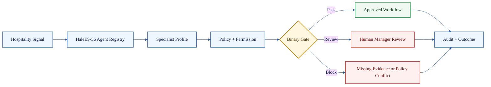

# HaleES Architecture Specification

**Governed operational intelligence for systems where a useful answer is not the same thing as a trusted action.**

  
  
  
  
  

Published by **Jason Hale, Founder of HaleES**.

> [!IMPORTANT]
> HaleES starts with governance, not generation. This repository shares the public architecture, agent taxonomy, reference code, validators, use cases, field notes, failure cases, and benchmark plan. The production HaleES/Sensei OS runtime remains closed.

## HaleES System Plan

This map shows the HaleES platform plan across sources, Sensei OS control, store runtime, persistence, integrations, and operating domains.

It is a system plan, not a production-complete component claim.

## Front Door

| Need | Start here |
| --- | --- |
| Read the visual whitepaper | [Whitepaper Reader](whitepaper/README.md) |
| Read the complete archive | [Full Whitepaper Archive](FULL_WHITEPAPER.md) |
| Study the 56-agent hospitality architecture | [HaleES-56 Hospitality Agent Architecture](HALEES_56_HOSPITALITY_AGENT_ARCHITECTURE.md) |
| Browse the public agent registry | [HaleES-56 Agent Registry](agents/README.md) |
| Run the HaleES-56 reference demo | [HaleES-56 Reference Implementation](reference/halees_56/README.md) |
| Review use cases | [Use Cases](USE_CASES.md) |
| Review operational field notes | [Field Notes](FIELD_NOTES.md) |
| Understand current limitations | [Limitations](LIMITATIONS.md) |
| See how benchmarks will be measured | [Benchmark Plan](BENCHMARK_PLAN.md) |
| Inspect public JSON examples | [HaleES-56 Example Inputs](examples/halees_56/README.md) |
| See HaleES block a bad action | [Failure Case: Labor Cut](examples/failure-case-labor-cut.md) |
| Understand contracts | [Contract Spec](CONTRACT-SPEC.md) |
| Understand scoring | [Grading Rubric](GRADING-RUBRIC.md) |
| Understand enforcement telemetry | [Observability And Enforcement Telemetry](docs/observability.md) |
| Understand rule governance | [Managing Enforcement Rules At Scale](docs/rule-management.md) |
| Understand grader trust | [Grader Reliability](GRADER_RELIABILITY.md) |
| Understand model and tool control | [Model, Tool, And Orchestration Governance](MODEL_TOOL_AND_ORCHESTRATION_GOVERNANCE.md) |
| Understand what stays closed | [Public Boundary](PUBLIC_BOUNDARY.md) |
| Run shape checks | [Validators](validators) |
| Inspect JSON Schemas | [Schemas](schemas) |

## What This Is

HaleES is a public architecture specification for governed operational intelligence in hospitality and service operations.

A useful answer can still be unsafe to trust. HaleES treats that as the starting point.

| Public pattern | Meaning |
| --- | --- |
| Contract-driven work | The task is defined before execution begins |
| Dual-layer grading | 0 to 100 evaluates; 0 or 1 decides |
| HaleES-56 agent taxonomy | Hospitality work is mapped into governed specialist capability profiles |
| Policy and authority checks | Capability does not equal permission |
| Ground-truth checks | Stale or missing data can block acceptance |
| Human review | Sensitive work routes to manager approval instead of silent execution |
| Auditability | Decisions should be explainable after the fact |
| Reference code | Deterministic public code makes the pattern inspectable without exposing the runtime |

## Evidence Level

| Evidence type | Included now | Not claimed yet |
| --- | --- | --- |
| Architecture | System plan, whitepaper, public boundary, HaleES-56 taxonomy | Production-complete open runtime |
| Reference code | Public deterministic registry, router, policy gate, examples, and demo runner | Closed HaleES/Sensei OS runtime |
| Examples | Use cases, field notes, JSON scenario inputs, failure cases | Customer case studies |
| Evaluation | Benchmark plan, validators, reference tests | Independent benchmark results |
| Integrations | Integration boundaries and public-safe examples | Live POS/PMS/KDS/payroll adapters |

## What You Can Run Today

This repository is not the HaleES runtime, but it includes small public reference tools.

| Runnable piece | Command | Purpose |
| --- | --- | --- |
| HaleES-56 reference demo | `python reference/halees_56/demo.py` | Routes hospitality signals through the public agent registry and deterministic policy gate |
| HaleES-56 reference tests | `python reference/halees_56/test_reference_behavior.py` | Checks registry count, routing, pass/review/block behavior |
| Mock contract loop | `python reference/end_to_end_mock_loop.py` | Shows contract, mock execution, dummy grading, decision, feedback, and iteration |
| Contract validator | `python validators/contract_validator.py examples/staffing_recovery_contract.md` | Checks whether a markdown contract has the expected public sections |
| Grading validator | `python validators/grading_validator.py examples/sample_grading_result.json` | Checks whether a grading result has the expected public fields and threshold decision |

## HaleES-56 Reference Flow

## Public Use Case Coverage

| Use case | Public proof path |
| --- | --- |
| Same-day call-off coverage | [Use case](USE_CASES.md#use-case-1--same-day-call-off-coverage) · [JSON input](examples/halees_56/call_off_coverage.json) · reference demo |
| Labor cut blocked by service ratio | [Failure case](examples/failure-case-labor-cut.md) · validators · grading rubric |
| Guest complaint refund review | [Use case](USE_CASES.md#use-case-3--guest-complaint-recovery) · [JSON input](examples/halees_56/guest_refund_review.json) |
| Stale inventory blocks prep change | [Use case](USE_CASES.md#use-case-4--stale-inventory-blocks-prep-change) · [JSON input](examples/halees_56/stale_inventory_prep_block.json) |
| KDS delay triggers bottleneck review | [Use case](USE_CASES.md#use-case-6--kds-delay-triggers-kitchen-bottleneck-review) |
| Payroll or tip-pool exception | [Use case](USE_CASES.md#use-case-8--payroll-or-tip-pool-exception) |
| Offline mode queues work | [Use case](USE_CASES.md#use-case-9--offline-mode-queues-work) |

## What Stays Closed

| Closed area | Why it stays closed |
| --- | --- |
| Production HaleES/Sensei OS runtime | Commercial product engine |
| Proprietary grader implementation | Core reliability logic |
| Internal agent prompts | Private operating instructions and runtime behavior |
| Model and tool routing | Operational execution logic |
| Live integrations and adapters | Customer systems and commercial infrastructure |
| Memory boundary implementation | Private data governance layer |
| Hosted infrastructure | Deployment and operations layer |
| Private datasets | Customer, employee, guest, transaction, and store data |

## License and Commercial Boundary

The public architecture materials in this repository are licensed under Apache-2.0.

| Public under Apache-2.0 | Requires separate HaleES agreement |
| --- | --- |
| Architecture specification | Production HaleES/Sensei OS runtime |
| Public examples and mock loops | Proprietary grader implementation |
| Public schemas and validators | Live integrations and production adapters |
| Public diagrams and documentation | Hosted infrastructure and deployment systems |
| Public HaleES-56 agent architecture | Internal prompts, proprietary execution logic, and runtime implementation |
| Public deterministic reference code | Production execution engine, private model routing, and closed-source adapters |

Commercial teams may study, fork, and build from the public architecture materials under Apache-2.0 terms. Commercial access to the HaleES production runtime, proprietary implementation, partnerships, support, or private deployment work requires a separate agreement with HaleES / Jason Hale.

## What Not To Overclaim

This repository does not currently claim independent benchmarks, live customer deployments, measured revenue lift, measured labor savings, or production integration reliability. Those belong in the repo only after evidence exists.

## Patent Pending Notice

Patent pending. A provisional patent application covering the grading and orchestration system was filed in November 2025.

This notice is provided for transparency about the architecture direction and does not claim a granted patent.

## Closing Statement

> [!IMPORTANT]
> Governance is not something added after generation. Governance is the system.

HaleES separates knowledge from authority, output from acceptance, agent profiles from execution authority, and public architecture from private runtime.

The goal is not less intelligence.

The goal is intelligence that can be trusted in production.
