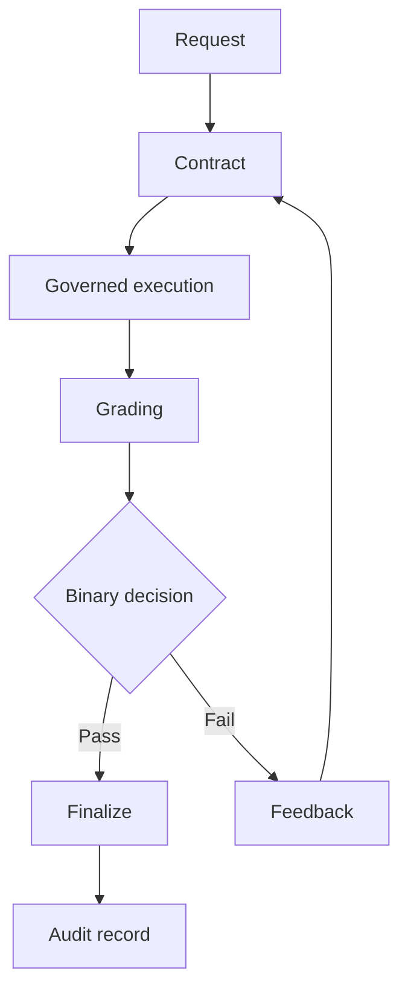
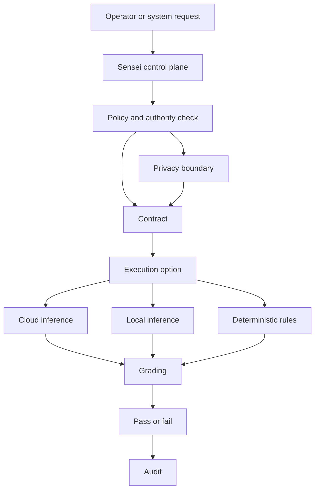

<div align="center">

# HaleES Architecture Specification


**Governed operational intelligence for systems where a useful answer is not the same thing as a trusted action.**

<p align="center">
  <a href="https://github.com/FatherHale/HaleES-Architecture/blob/main/LICENSE.md">
    
  </a>
  
  
  
</p>

</div>

> [!IMPORTANT]
> HaleES starts with governance, not generation. This repository shares the public contract, grading, privacy, and governance pattern. The production Sensei OS runtime stays closed.

## Front Door

| Need | Start here |
| --- | --- |
| Read the designed whitepaper reader | [Designed Whitepaper Reader](whitepaper/README.md) |
| Read the full public whitepaper archive | [Full Whitepaper](FULL_WHITEPAPER.md) |
| Run the public demo loop | [Quickstart](QUICKSTART.md) |
| Understand contracts | [Contract Spec](CONTRACT-SPEC.md) |
| Understand scoring | [Grading Rubric](GRADING-RUBRIC.md) |
| Understand grader trust | [Grader Reliability](GRADER_RELIABILITY.md) |
| Understand model and tool control | [Model, Tool, And Orchestration Governance](MODEL_TOOL_AND_ORCHESTRATION_GOVERNANCE.md) |
| Understand what stays closed | [Public Boundary](PUBLIC_BOUNDARY.md) |
| See public examples | [Examples](examples) |
| Run shape checks | [Validators](validators) |
| Inspect JSON Schemas | [Schemas](schemas) |
| See where the spec is going | [Spec Evolution](SPEC_EVOLUTION.md) |

## What This Is

HaleES is a public architecture specification for governed operational intelligence.

A useful answer can still be unsafe to trust. HaleES treats that as the starting point.

| Public pattern | Meaning |
| --- | --- |
| Contract driven work | The task is defined before execution begins |
| Dual layer grading | 0 to 100 evaluates, 0 or 1 decides |
| Local first and cloud capable inference | Intelligence can run where the task needs it |
| Privacy boundaries | Context is governed before it is used |
| Model, tool, and orchestration governance | Capability does not equal authority |
| Auditability | Decisions should be explainable after the fact |

The private product runtime is not published here.

## What You Can Run Today

This repository is not the HaleES runtime, but it includes small public reference tools.

| Runnable piece | Command | Purpose |
| --- | --- | --- |
| Mock contract loop | `python reference/end_to_end_mock_loop.py` | Shows contract, mock execution, dummy grading, decision, feedback, and iteration |
| Contract validator | `python validators/contract_validator.py examples/staffing_recovery_contract.md` | Checks whether a markdown contract has the expected public sections |
| Grading validator | `python validators/grading_validator.py examples/sample_grading_result.json` | Checks whether a grading result has the expected public fields and threshold decision |

> [!NOTE]
> These tools are intentionally small. They let people touch the public pattern without exposing the private HaleES engine.

## Current Status

This is an early public specification with runnable reference material.

| Public artifact | What it does | What it is not |
| --- | --- | --- |
| [Designed Whitepaper Reader](whitepaper/README.md) | Presents the whitepaper as a visual multi-part reader | Not the production runtime |
| [Full Whitepaper](FULL_WHITEPAPER.md) | Preserves the complete long-form paper in one file | Not the production runtime |
| [Mock loop](reference/end_to_end_mock_loop.py) | Shows contract, mock execution, dummy grading, decision, feedback, and iteration | Not the production runtime |
| [Validators](validators) | Check public contract and grading result shape | Not the production grader |
| [JSON Schemas](schemas) | Define public JSON shapes | Not the private schema system |
| [Examples](examples) | Show public safe scenarios | Not customer data or runtime logic |
| [Reliability notes](GRADER_RELIABILITY.md) | Explain public grader trust questions | Not private scoring implementation |

> [!TIP]
> Start with `whitepaper/README.md` for the designed reader, or `python reference/end_to_end_mock_loop.py` if you want to see the loop move instead of only reading about it.

## What Stays Closed

| Closed area | Why it stays closed |
| --- | --- |
| Production Sensei OS runtime | Commercial product engine |
| Private grader | Core reliability implementation |
| Model routing | Operational routing logic |
| Tool routing | Execution authority logic |
| Orchestration budgets | Internal safety and cost controls |
| Memory boundaries | Private data governance implementation |
| Marketplace enforcement | Commercial enforcement layer |
| Hosted infrastructure | Deployment and operations layer |
| Private datasets | Customer and operational data |

This boundary is intentional. The public specification explains the pattern. The private runtime remains the machine.

## Core Concepts At A Glance

| Concept | HaleES stance |
| --- | --- |
| Generation | Useful, but not enough |
| Authority | Must be granted, not assumed |
| Skills | Knowledge, not permission |
| Contracts | Define the work before execution |
| Grading | Measures whether the output satisfies the contract |
| Binary decision | Creates a clear pass or fail gate |
| Iteration | Improves failed work inside limits |
| Audit | Preserves what happened and why |

> [!NOTE]
> Most agent frameworks chase flexibility. HaleES is built for survival in real operations.

## Public Flow Diagram



## Public Component View



## The Operating Problem

| Common failure | HaleES response |
| --- | --- |
| A model gives a plausible answer | The answer still has to pass the contract |
| A tool can act | The tool still needs authority |
| A workflow retries forever | Iteration stays bounded |
| A score looks confident | Confidence stays separate from pass or fail |
| Cloud inference is unavailable or inappropriate | Local or deterministic paths can still matter |
| Private data could leak across contexts | Privacy boundaries stay part of execution authority |

HaleES is not a chatbot for hospitality. It is a governed operational intelligence layer where models, local inference, deterministic rules, human approvals, and audited execution work inside one control system.

## Local First, Cloud Capable Intelligence

| Path | Public purpose |
| --- | --- |
| Cloud inference | Heavier reasoning, long context analysis, research, cross property coordination |
| Local or device level inference | Lower latency work, privacy sensitive workflows, offline continuity, site support |
| Deterministic execution | Rules, scores, constraints, schemas, queues, and approved tools |

This makes HaleES model flexible rather than model dependent.

The model is one reasoning surface inside a governed operating system, not the whole product.

## Privacy First Data Boundary

| Principle | Meaning |
| --- | --- |
| Minimum necessary context | Only the context needed for the task should be available |
| Governed memory boundaries | Personal, organizational, and cross organization intelligence stay separated by permission |
| Pattern learning without exposure | Shared intelligence improves through generalized patterns, not private data leakage |

Privacy, permission, and execution authority belong in the same governance layer.

## Skills Are Knowledge, Not Authority

> [!IMPORTANT]
> A skill, prompt, model, tool, or workflow does not gain permission just because it exists or can execute.

In HaleES, authority must come from governance signals such as verified identity, applicable policy, risk classification, approval requirements, and audited execution context.

Many failures are not failures of generation. They are failures of authorization.

## Sensei As Control Plane

| Part | Public role |
| --- | --- |
| Models | Specialists |
| Tools | Governed capabilities |
| Contracts | Work definition |
| Grading | Acceptance check |
| Authority boundary | Decision control |

Sensei is not one model, one chat screen, one route, or one button.

Sensei is the governance and orchestration control plane.

## Dual Layer Grading

| Layer | Purpose |
| --- | --- |
| 0 to 100 score | Evaluates accuracy, efficiency, constraint adherence, quality, and timeliness |
| 0 or 1 decision | Decides whether the output passes the threshold |
| Confidence | Tracks certainty separately from pass or fail |
| Feedback | Guides the next iteration when the result fails |

No decision exists without scoring. No scoring matters without a decision.

## Contract Driven Loop

| Step | What happens |
| --- | --- |
| 1 | The orchestrator creates a contract with objective, constraints, acceptance criteria, and expected output shape |
| 2 | The agent, model, or tool executes against that contract |
| 3 | The system grades the output |
| 4 | A passing result can be finalized |
| 5 | A failing result receives feedback and iterates |
| 6 | Iteration stops at the configured limit |

Generation alone never finalizes work. Acceptance is governed.

## Sample Public Contract Snippet

```markdown
# Contract

Objective
Create a same day staffing recovery plan for a missed shift.

Authority boundary
The output may recommend actions, but it may not directly change the schedule or contact employees without approval.

Required output
1. Situation summary.
2. Coverage risk.
3. Recovery options.
4. Recommended option.
5. Escalation trigger.

Acceptance criteria
1. The plan identifies the uncovered role and time window.
2. The plan provides at least two recovery options.
3. The plan respects role permission and labor constraints.
4. The plan explains when a manager should intervene.

Decision threshold
Global score must be 85 or higher.
```

## Public Examples And Reference Material

| Resource | What it shows |
| --- | --- |
| [Staffing recovery](examples/staffing_recovery_contract.md) | Speed and operational clarity |
| [Privacy sensitive guest recovery](examples/privacy_sensitive_guest_recovery.md) | Minimum necessary context |
| [Cross property coordination](examples/cross_property_coordination.md) | Pattern learning without private data exposure |
| [Non hospitality incident response](examples/non_hospitality_incident_response.md) | The same authority pattern outside restaurants |
| [Rubric samples](examples/rubric_pass_and_fail_samples.md) | Public pass and fail reasoning |
| [Sample contract JSON](examples/sample_contract.json) | Public contract shape |
| [Sample grading result JSON](examples/sample_grading_result.json) | Public grading result shape |
| [Mock loop](reference/end_to_end_mock_loop.py) | Runnable local demonstration |

## Adoption Path

| Use case | Public safe path |
| --- | --- |
| Learn the pattern | Read the contract and grading docs |
| Test the shape | Run validators against examples |
| See the loop | Run the mock Python script |
| Build around the public spec | Use the schemas and examples |
| Discuss the architecture | Open issues without private data or runtime details |

The open specification shares the principle. The private HaleES runtime remains the machine.

## How HaleES Differs From Flexibility First Frameworks

| Dimension | Flexibility first pattern | HaleES pattern |
| --- | --- | --- |
| Main goal | Capability and experimentation | Governed execution |
| Authority | Often prompt driven | Explicitly bounded |
| Acceptance | Informal or reviewer based | Contract and grading based |
| Retry behavior | Can drift or loop | Bounded iteration |
| Privacy | Often provider or app level | Part of execution authority |
| Models | Often the center | One reasoning surface inside the system |
| Tools | Capability first | Permission first |
| Audit | Variable | Part of the pattern |

This is not a claim that every other framework is wrong. It is a different design objective.

## Public Specification Boundary

| Included publicly | Remains proprietary |
| --- | --- |
| Contract format | Sensei OS production runtime |
| Grading rubric | Closed source grader implementation |
| Public examples | Model routing implementation |
| JSON samples and schemas | Local and cloud inference routing implementation |
| Shape validators | Private memory boundary implementation |
| Grader reliability notes | Command and execution engine |
| Mock loop | Marketplace enforcement engine |
| Governance principles | Production deployment systems |

## Patent Pending Notice

Patent pending. A provisional patent application covering the grading and orchestration system was filed in November 2025.

This notice is provided for transparency about the architecture direction and does not claim a granted patent.

## Closing Statement

> [!IMPORTANT]
> Governance is not something added after generation. Governance is the system.

| HaleES separates | Because |
| --- | --- |
| Knowledge from authority | Knowing is not permission |
| Output from acceptance | Generation does not equal trust |
| Score from decision | Nuance and execution need different layers |
| Confidence from pass or fail | Certainty should not erase review needs |
| Public specification from private runtime | The pattern can be shared without exposing the engine |

HaleES exists for organizations that need reliable and auditable execution instead of best effort autonomy.

The goal is not less intelligence.

The goal is intelligence that can be trusted in production.
