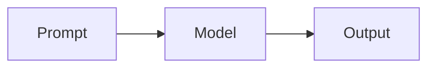
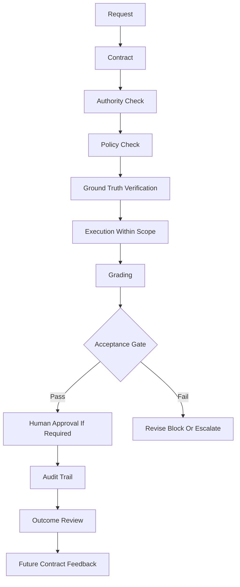
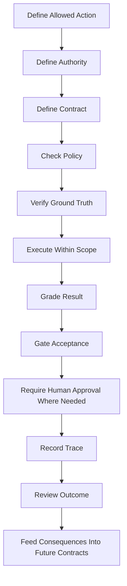

# HaleES Whitepaper

## Enforcement First AI Operations for Hospitality

**Public architecture paper for governed hospitality intelligence.**

  
  
  
  
  

> [!IMPORTANT]
> HaleES starts with enforcement, not generation. This paper shares the public architecture pattern. The production HaleES runtime remains closed.

## Paper Metadata

| Field | Value |
| --- | --- |
| Author | Jason Hale |
| Project | HaleES |
| Status | Public architecture paper |
| Runtime | Closed |
| Architecture pattern | Public |
| Repository | https://github.com/FatherHale/HaleES-Architecture |

## Abstract

Artificial intelligence is moving from answering questions to taking action. In hospitality, that shift cannot be treated casually. Restaurants, hotels, and service businesses operate under constant pressure from labor constraints, guest expectations, thin margins, compliance requirements, accountability gaps, and fast moving operational decisions.

A useful AI answer is not the same thing as a safe decision. A safe decision is not the same thing as permission to act.

This whitepaper introduces the public architecture pattern behind HaleES. HaleES is being designed as an enforcement first hospitality operating layer built around authority, contracts, grading, audit trails, consequence review, privacy boundaries, external ground truth, identity verification, emergency downshifting, and human control before automation.

The production HaleES runtime remains closed. This paper explains the public architecture pattern.

## Executive Thesis

| Principle | Meaning |
| --- | --- |
| Knowledge is not authority | Knowing the right answer does not grant permission to act |
| Generation is not acceptance | Output must be evaluated before it becomes operational |
| Scores are not decisions | A score informs the gate; the gate controls action |
| Authority is bounded | A high role cannot silently override hard policy |
| Human control is governed | Human approval must be recorded, not used as a loophole |
| Outcomes matter | A decision is not proven until its operational consequence is reviewed |

> [!NOTE]
> The future of AI in hospitality will not be won by the system that talks the most. It will be won by the system that knows when it is allowed to act.

## 1. The Problem

Most AI systems are designed around generation.

They answer questions. They summarize information. They suggest next steps. They create schedules, workflows, messages, images, and recommendations.

That is useful, but it is not enough for real operations.

In hospitality, an AI system may eventually be asked to recommend a labor cut, adjust a schedule, escalate a call off, message a team member, flag performance concerns, summarize guest complaints, generate corrective action, recommend ordering decisions, detect operational drift, or trigger workflows across multiple tools.

Each one of those actions carries consequences.

A wrong answer can waste time. A wrong action can damage trust, cost money, violate policy, create liability, or undermine a manager's authority.

The core problem is simple.

Most AI systems are optimized to produce output. They are not built to prove whether that output is allowed to become action.

Hospitality does not need another chatbot wrapper sitting on top of operations. Hospitality needs an intelligence layer that understands permission, accountability, timing, roles, service pressure, and consequence.

## 2. The Central Claim

The next phase of AI in business will not be defined only by better models.

It will be defined by better control systems around those models.

AI should not be trusted to act simply because it sounds useful. It must earn permission through authority checks, task contracts, grading, auditability, human review, and consequence feedback.

This is the difference between answer generation and trusted action.

## 3. Why Hospitality Is the Right Starting Point

Hospitality is an ideal proving ground for enforcement first AI because it is operationally dense.

A restaurant or hotel is not just a place where tasks happen. It is a live environment where labor, demand, service timing, guest emotion, compliance, inventory, cleanliness, training, communication, and leadership all collide in real time.

Managers already make hundreds of small decisions every day.

They decide who should be cut first. They decide who can cover a call off. They decide which station is falling behind. They decide whether labor is safe. They decide whether a guest complaint is isolated or part of a pattern. They decide whether a schedule is fair. They decide whether the store is staffed for the rush. They decide whether something is a coaching moment or a policy issue.

These are not only data questions. They are authority questions.

The system must know not only what can be done, but who is allowed to do it, under what conditions, with what evidence, and with what record of accountability.

That is the foundation HaleES is being built around.

## 4. From AI Suggestions to Governed Execution

A standard AI workflow often looks like this.

That pattern is not enough for operations.

HaleES uses a stricter pattern.

This creates a boundary between intelligence and authority.

The AI can assist. The AI can recommend. The AI can prepare. The AI can execute within approved limits.

But it does not automatically inherit permission.

## 5. Authority Before Execution

Authority is not a feature added later. It must be part of the foundation.

A system that can generate a schedule does not automatically have the right to publish that schedule.

A system that can identify labor waste does not automatically have the right to cut employees.

A system that can draft a message does not automatically have the right to send it.

HaleES treats authority as a first class control layer. Every meaningful action should be evaluated against identity, role, scope, policy, context, and risk before execution.

## 6. Authority Does Not Override Core Policy

HaleES separates authority from permission.

A person can have a high role and still make a request the system should not execute.

A general manager may have authority over a store. That does not mean the general manager can override labor law, safety policy, wage rules, minor restrictions, privacy rules, refund controls, security controls, or required staffing ratios.

This requires a constitutional layer.

The constitutional layer defines rules that sit above normal role authority.

These rules are not suggestions. They are hard boundaries.

| Constitutional boundary | Example |
| --- | --- |
| Labor law | Minor restrictions, overtime, wage rules |
| Food safety | Handling, storage, cleanliness, temperature requirements |
| Privacy | Employee, guest, and business data rules |
| Financial controls | Refund limits, payroll changes, vendor exposure |
| Security controls | Permission grants, identity, integration access |
| Service model constraints | Required staffing ratios, brand standards, safety coverage |

If the request violates the constitutional layer, the acceptance gate must fail.

Authority gives a user the right to request action.

Policy decides whether that action is allowed.

## 7. Contracts Before Tasks

A task should not be handed to an AI as a vague prompt and accepted because the response sounds good.

In this architecture, work is framed as a contract.

A contract defines the objective, operating context, required inputs, constraints, role boundaries, acceptance criteria, risk level, allowed tools, expected output format, grading rules, iteration limits, audit requirements, and outcome review requirements.

This matters because vague prompts create vague accountability.

A contract gives the system something to enforce.

> Create a proposed schedule for a specific store and date using approved employees only. Respect availability, labor targets, role coverage, minor restrictions, overtime limits, staffing ratios, and manager approval requirements. Do not publish the schedule. Return a proposal with reasoning, risk notes, and any constraint violations.

The contract turns AI work into bounded operational work.

## 8. Staffing Ratios as Hard Constraints

Some operating rules should be treated as identity level constraints.

A luxury property, a budget property, a quick service restaurant, a full service restaurant, and a high volume bar do not operate with the same staffing logic.

Their ratios are not just numbers. They define the service promise.

If a luxury property requires one employee for every eight active guests at a certain service point, the system should not approve a plan that creates one employee for every fifteen active guests unless an emergency override is recorded.

If a proposed labor plan violates a hard ratio, the grading layer should trigger a failed acceptance gate.

A plan can save money and still be wrong.

A labor recommendation is only valid if it protects the service model it is operating inside.

## 9. External Ground Truth

Hospitality depends on outside systems.

Inventory, vendor delivery, weather, local events, utilities, payment systems, delivery platforms, reservation platforms, and point of sale systems can all change the operating reality.

HaleES should not treat internal memory as the only source of truth.

If the system recommends a menu special based on inventory, it should verify the inventory state and vendor state before the recommendation is accepted.

If a vendor delivery is delayed, if a local farmer shorted a delivery, if the walk in cooler is down, or if a vendor connection cannot be reached, the contract must reflect that uncertainty.

A recommendation built on stale or missing external data should not be treated the same as a recommendation built on verified ground truth.

## 10. Grading Before Acceptance

HaleES uses grading as a core architectural primitive.

The system should not accept output simply because it exists. It must evaluate output before allowing it to move forward.

| Layer | Purpose |
| --- | --- |
| 0 to 100 scoring | Provides nuance across quality, risk, and constraint adherence |
| 0 or 1 acceptance | Creates a clear operational pass or fail decision |
| Feedback | Explains what must change when the result fails |
| Escalation | Moves unsafe, incomplete, or high-risk work to review |

A result can be useful and still not be allowed to act.

This is the difference between evaluation and permission.

## 11. Post Execution Outcome Review

HaleES does not stop grading once an action is approved.

A decision can pass the contract, pass the authority check, pass the policy check, pass the grading layer, receive human approval, and still produce a bad result in the real operation.

If the system recommends a labor cut and the manager approves it, the first grade only proves that the recommendation looked correct at the time. It does not prove that the decision worked.

HaleES needs a second review layer after execution.

A labor cut may be approved. Ninety minutes later, ticket times may increase, guest complaints may rise, cleaning may fall behind, or the manager may need to call someone back in.

That outcome must be attached to the original decision.

A decision is not proven at approval.

A decision is proven by what happened after it entered the operation.

## 12. Iteration Without Drift

AI systems often improve through iteration, but uncontrolled iteration creates drift.

HaleES treats iteration as bounded.

If an output fails grading, the system may return feedback and request another attempt. But the task contract remains the anchor.

The goal is not endless generation. The goal is contract compliant completion or clear refusal and escalation.

## 13. Operational Drift Monitoring

HaleES must watch for drift in the operation, not only drift in the model.

A manager can become tired. A leader can start rubber stamping approvals. A team can normalize bad shortcuts. A store can slowly move away from its own standards.

This creates approval drift.

If a manager approves every recommendation without review, the system should not assume that all recommendations are good. It should recognize the pattern as a risk.

When this happens, the system can raise the review level.

The purpose is not to trick the manager.

The purpose is to protect the operation from blind approval.

## 14. Identity and Presence Verification

Role based authority is not enough in a live hospitality environment.

A manager tablet can be left unlocked. A team member can use someone else's screen. A rushed supervisor can approve something without realizing which account is active.

For low risk actions, normal session identity may be enough.

For high risk actions, HaleES should require step up verification.

Step up verification may require a PIN, biometric check, second approval, or another trusted confirmation method.

The higher the risk, the stronger the identity check should be.

## 15. Emergency Mode

Hospitality operations can break normal patterns quickly.

Power outages, floods, illness outbreaks, violence, payment failures, equipment failures, weather events, and vendor breakdowns can all make normal automation unsafe.

When the environment becomes unstable, HaleES should downshift.

Emergency mode lowers automation authority.

The system can still assist, but it should become more conservative.

In emergency mode, HaleES should prioritize human control, clear communication, safety, documentation, escalation, simple checklists, and reduced automation.

Optimization comes later.

## 16. Audit Trails Before Trust

Trust cannot depend only on confidence.

In operations, trust requires a record.

HaleES is designed around auditability. Meaningful AI actions should leave behind structured traces.

The system should record who initiated the request, what identity or role was active, what contract governed the task, what data was used, what tools were called, what output was produced, how the output was graded, whether the acceptance gate passed or failed, whether a human approved or overrode the result, what final action was taken, and what happened afterward.

Auditability is not paperwork.

It is operational memory.

## 17. Privacy Boundaries Before Memory

AI memory is powerful, but in business it can become dangerous if boundaries are unclear.

HaleES separates memory into controlled layers.

| Memory layer | Boundary |
| --- | --- |
| Personal memory | Belongs to the individual and may include preferences, private workflows, personal notes, or user specific context |
| Organization memory | Belongs to the business and may include store policies, operating procedures, role structures, schedules, events, approved workflows, and organizational knowledge |
| Global pattern intelligence | Pattern based learning across contexts without exposing one customer's private data to another customer |

Memory must be permissioned.

## 18. Human Control Before Automation

HaleES does not assume that full automation is the goal.

In many hospitality workflows, the correct outcome is not that AI did it.

The correct outcome is that AI prepared it, checked it, explained it, flagged the risk, recommended the action, routed it for approval, recorded the decision, and reviewed the consequence.

Automation should be earned, not assumed.

| Risk level | Control posture |
| --- | --- |
| Low risk repetitive actions | May become automated inside narrow limits |
| Medium risk actions | Require review, traceability, and bounded authority |
| High risk actions | Require human approval or escalation |
| Sensitive actions | Require stronger identity verification and audit trail |
| Prohibited actions | Must remain blocked regardless of user role |

The goal is not to remove managers from operations. The goal is to give managers a stronger operating layer.

## 19. Liability and Human Override

HaleES is designed to support accountable decision making, not remove accountability from the business.

The system can recommend, check, grade, document, and enforce boundaries.

The human operator remains responsible for final approval where the action requires human judgment, legal responsibility, or business authority.

Human override is not a loophole.

It is a controlled governance event.

When a human overrides the system, HaleES should record who overrode it, what was overridden, what warning was shown, what reason was given, what policy was affected, and what happened afterward.

> [!IMPORTANT]
> The legal firewall is not human approval alone. The stronger firewall is the combination of hard policy boundaries, authority checks, identity verification, external ground truth, grading, audit trails, consequence review, and human approval for high risk actions.

The purpose of the architecture is not to make AI legally responsible for the business.

The purpose is to make decisions more traceable, more governed, and harder to execute blindly.

HaleES should reduce risk.

It should not pretend risk disappears.

## 20. Creative Generation and Brand Governance

HaleES may also support creative workflows, such as generating images, videos, menus, training visuals, social posts, hiring assets, and promotional material.

Even creative generation should be governed.

The system should check brand rules, approved claims, food representation standards, copyright risk, employee likeness rules, guest privacy, pricing accuracy, offer terms, and whether manager approval is required before publishing.

The creative engine can generate the asset.

HaleES decides whether the request is allowed, whether the result is acceptable, and whether the asset can be used.

## 21. The Enforcement First Pattern

The enforcement first pattern can be summarized as a sequence of governed steps.

This pattern can apply across hospitality workflows such as scheduling, shift swaps, call off handling, labor recommendations, task assignment, cleaning checks, inventory workflows, guest recovery, training guidance, manager communication, incident documentation, performance coaching, forecasting, preparation, and marketing content creation.

## 22. Example: Call Off Handling

A team member calls off two hours before a dinner rush.

A basic chatbot might say to ask another employee to cover the shift.

An enforcement first system should check who is calling off, what role was scheduled, what time the shift starts, what station coverage is affected, who is available, who is eligible, who is near overtime, who has role permissions, who has already worked too many days, what manager approval is required, what communication is allowed, and what policy applies.

The system may then propose a ranked list of replacement options, a coverage risk score, a draft message to eligible employees, a manager approval step, a record of the incident, and a follow up workflow if needed.

The system should not blast messages or change the schedule unless authority allows it.

This is trusted action.

## 23. Example: Labor Adjustment

A manager is running high labor during a slow period.

A basic AI tool might recommend cutting two employees.

An enforcement first system should evaluate current sales, forecasted demand, required station coverage, skill mix, break requirements, employee roles, fairness rules, minor restrictions, upcoming rush timing, guest experience risk, manager authority, store policy, and staffing ratios.

The result might recommend cutting one cashier at a specific time if sales remain below threshold for a defined period. It may also recommend not cutting grill or expo because prep and coverage risk are still high.

That recommendation should require manager approval if it affects staffing.

This is governed decision support.

## 24. Example: Vendor Dependent Menu Decision

A restaurant wants to run a menu special based on current inventory.

A basic AI tool might suggest a dish using ingredients that appear available in the system.

An enforcement first system should check whether the inventory count is current, whether the vendor delivery arrived, whether there were shorts or substitutions, whether the item is still within quality standards, whether the point of sale item is active, whether the kitchen can execute the special, and whether the offer language is approved.

If vendor status cannot be verified, the system should lower confidence, require human confirmation, or block the recommendation depending on risk.

This prevents stale data from becoming operational action.

## 25. Example: Generated Marketing Asset

A restaurant asks HaleES to create a promotional image for a burger special.

Before generation, HaleES should verify the brand rules, offer details, claims, allowed style, image restrictions, and approval level.

After generation, HaleES should grade the asset for brand fit, clarity, accuracy, policy compliance, and publishing risk.

The image may look good and still fail if it shows the wrong product, implies an unauthorized discount, uses a protected likeness, or violates the brand standard.

This keeps creative speed inside operational control.

## 26. Open Architecture and Closed Runtime

The public HaleES architecture exists to share the pattern without exposing the production runtime.

| Public layer | Closed runtime |
| --- | --- |
| Concepts | Production orchestration |
| Schemas | Proprietary grading logic |
| Contract examples | Business specific data handling |
| Validator patterns | Live integrations |
| Mock loops | Internal execution logic |
| Reference flows | Deployment infrastructure |
| Governance primitives | Commercial product workflows |

This approach allows public credibility without giving away the operating engine.

The goal is to make the thinking inspectable while keeping the product defensible.

## 27. Why This Matters Now

AI tools are becoming easier to connect to business systems.

That creates opportunity, but it also increases risk.

The question is no longer only what AI can generate.

The better question is what AI should be allowed to do, under what authority, with what evidence, and with what record.

Hospitality operators do not need uncontrolled automation.

They need controlled leverage.

## 28. Design Principles

| Principle | Explanation |
| --- | --- |
| Knowledge is not authority | Knowing what should happen does not mean having permission to do it |
| Generation is not acceptance | An output must be evaluated before it becomes operational |
| Confidence is not proof | A confident model can still be wrong, incomplete, stale, or unauthorized |
| Scores are not decisions | A score informs the gate; the gate determines whether action can proceed |
| Authority does not override core policy | A high ranking user cannot silently bypass constitutional constraints |
| Automation must be bounded | Every automated action needs scope, limits, and rollback awareness |
| Humans remain accountable | AI can assist decision making, but operational accountability must remain clear |
| Memory must be permissioned | Private, organizational, and generalized intelligence must stay separated |
| Audit trails are infrastructure | If the system cannot explain what happened, it should not be trusted with meaningful action |
| Outcomes matter | A decision is not proven when it is approved; it is proven by what happens afterward |

## 29. What HaleES Is Building Toward

HaleES is being built as a hospitality operating layer where intelligence is connected to real operational authority.

The long term vision includes a governed Sensei intelligence layer, hospitality specific workflows, contract based task execution, role aware permissions, policy enforcement, grading and acceptance gates, human approval controls, external ground truth verification, post execution outcome analysis, operational memory boundaries, audit trails, creative generation modules, communication modules, marketplace ready modules, and local first or API powered execution where appropriate.

The purpose is not to make hospitality less human.

The purpose is to reduce operational chaos, preserve accountability, and give teams better systems of support.

## 30. Conclusion

The future of AI in hospitality will not be won by the system that talks the most.

It will be won by the system that knows when it is allowed to act.

A useful answer is not the same thing as a safe decision. A safe decision is not the same thing as permission to act.

That gap is where enforcement first AI operations begins.

The runtime remains closed.

The architecture pattern is public.

## Closing Statement

> [!IMPORTANT]
> Build hospitality intelligence that earns permission before it acts.
