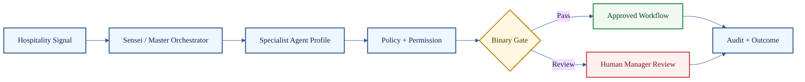

# HaleES Ratio-56 Agent Registry

**Seven governed hospitality agent clusters. Fifty-six specialist capability profiles. One execution authority.**

Published by **Jason Hale, Founder of HaleES**.

> [!IMPORTANT]
> These files are public architecture profiles, not internal prompts and not production runtime instructions. Agents describe specialist capability domains. Sensei / Master Orchestrator retains execution authority through policy, workflow, approval, and audit controls.

## Registry Structure

| Cluster | File | Count | Operating domain |
| --- | --- | ---: | --- |
| Control Plane | [control-plane.md](control-plane.md) | 12 | Routing, authority, planning, grading, memory, audit, escalation |
| Universal Operations | [universal-operations.md](universal-operations.md) | 10 | Opening, closing, SOPs, tasks, sanitation, maintenance, inventory, procurement |
| Guest and Communications | [guest-and-communications.md](guest-and-communications.md) | 8 | Concierge, recovery, VIP, reputation, voice, messaging, translation |
| Labor, Pay, and Workforce | [labor-pay-workforce.md](labor-pay-workforce.md) | 8 | Scheduling, call-offs, labor cost, performance, training, payroll, pay controls |
| Food, Beverage, and Prep | [food-beverage-prep.md](food-beverage-prep.md) | 8 | Kitchen flow, KDS, menu, recipes, prep, waste, alcohol compliance |
| Revenue, CRM, and Growth | [revenue-crm-growth.md](revenue-crm-growth.md) | 5 | Revenue, pricing, loyalty, campaigns, reporting |
| Systems, Payments, and Devices | [systems-payments-devices.md](systems-payments-devices.md) | 5 | POS/PMS/KDS, payments, kiosks, offline sync, remote assist |

## Operating Model

## Public Boundary

| Public here | Not public here |
| --- | --- |
| Agent names and responsibilities | Internal prompts |
| Capability boundaries | Production orchestration code |
| Example inputs and outputs | Proprietary grader implementation |
| Governance notes | Live customer workflows |
| Public-safe workflow maps | Secrets, adapters, infrastructure |

## How To Read

Start with `control-plane.md` to understand authority, routing, grading, and audit. Then read the operational clusters that match the hospitality workflow you care about.
