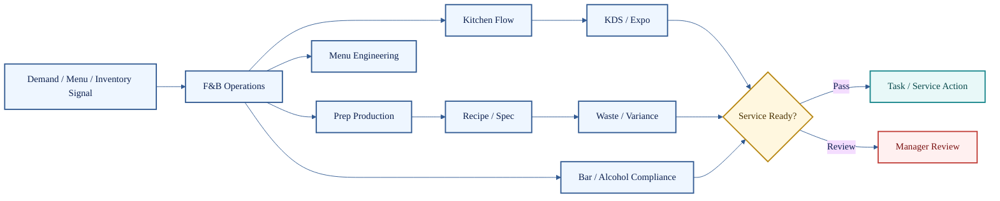

# Food, Beverage, and Prep Agents

**Cluster count:** 8 agents  
**Domain:** food and beverage operations, kitchen flow, KDS/expo, menu engineering, recipe standards, prep production, waste, variance, and bar compliance.

> [!IMPORTANT]
> Food and beverage decisions affect service speed, guest trust, cost, waste, safety, and compliance. Recommendations must be grounded in verified operational state.

## Cluster Role

Food, Beverage, and Prep agents connect demand, prep, inventory, kitchen capacity, ticket flow, product standards, and compliance controls.



## Agent Profiles

| # | Agent | What it does | Public-safe inputs | Public-safe outputs | Boundary |
| ---: | --- | --- | --- | --- | --- |
| 39 | F&B Operations Agent | Coordinates food and beverage operating priorities across service, prep, inventory, and standards. | Service state, menu, prep, inventory, standards. | F&B status, prep risk, action list. | Cannot override food safety or compliance boundaries. |
| 40 | Kitchen Flow Agent | Detects station imbalance, production delays, and kitchen bottlenecks. | Ticket times, station status, staffing, prep state. | Station alert, mitigation recommendation. | Labor/station changes require authority checks. |
| 41 | KDS / Expo Agent | Interprets ticket timing, order congestion, expo flow, and handoff risk. | KDS events, order age, item mix, expo notes. | Ticket warning, expo bottleneck, order-flow summary. | Does not replace human expo authority during service. |
| 42 | Menu Engineering Agent | Analyzes item performance, margin, pricing pressure, and menu positioning. | Sales mix, item cost, demand, guest feedback. | Item insight, margin note, promotion risk. | Menu/pricing changes require business approval. |
| 43 | Recipe / Spec Agent | Tracks recipe standards, portions, substitutions, and spec adherence. | Recipe spec, portion data, substitution request. | Spec card, quality warning, substitution note. | Unsafe or off-brand substitutions require review. |
| 44 | Prep Production Agent | Forecasts prep needs against demand, shelf life, inventory, and waste risk. | Forecast, par, inventory, shelf life, rush window. | Prep sheet, par adjustment, shortage warning. | Stale data should lower confidence or block action. |
| 45 | Waste / Variance Agent | Tracks waste, remakes, shrink, variance, and operational leakage. | Waste logs, sales, counts, remakes, voids. | Variance report, suspected cause, correction option. | Fraud/discipline claims require evidence and escalation. |
| 46 | Bar / Alcohol Compliance Agent | Supports bar readiness, inventory, age-sensitive controls, and alcohol compliance. | Bar stock, service rules, ID policy, variance. | Bar checklist, compliance warning, stock variance. | Alcohol-related workflows require strict legal controls. |

## Example Use Case

A rush forecast shows higher-than-normal demand. Prep Production checks par and shelf life, Inventory checks stock confidence, Kitchen Flow identifies station pressure, and Grading/QA determines whether the prep plan can become an approved task list.

```text
Rush forecast -> Prep plan -> Inventory confidence -> Kitchen capacity -> Service gate -> Task assignment or review
```

## Quality Standard

A food and beverage output is credible when it protects product quality, safety, compliance, service speed, inventory confidence, and manager approval boundaries.

[Back to Agent Registry](README.md)
