# Labor, Pay, and Workforce Agents

**Cluster count:** 8 agents  
**Domain:** scheduling, call-off coverage, labor cost, performance, training, recruiting, payroll prep, and pay controls.

> [!IMPORTANT]
> Workforce decisions affect people, pay, fairness, compliance, and service coverage. This cluster is governance-heavy by design.

## Cluster Role

Labor, Pay, and Workforce agents support staffing plans, coverage recovery, labor spend control, employee development, onboarding, payroll preparation, and pay-related review.

```mermaid
%%{init: {"theme":"base", "themeVariables": {"background":"#FFFFFF", "fontFamily":"Marcellus, Georgia, serif", "fontSize":"16px", "primaryTextColor":"#0B1F4D", "lineColor":"#315A92"}}}%%
flowchart LR
    A[Labor Signal] --> B[Scheduling]
    A --> C[Call-Off Coverage]
    B --> D[Labor Cost]
    C --> D
    D --> E[Policy + Permission]
    E --> F{Workforce Gate}
    F -->|Pass| G[Manager Approval Packet]
    F -->|Blocked| H[Revise or Escalate]
    G --> I[Payroll / Performance / Training Context]
    H --> I
    I --> J[Audit + Outcome]

    classDef blue fill:#EEF6FF,stroke:#315A92,stroke-width:2px,color:#0B1F4D;
    classDef orange fill:#FFF4E6,stroke:#D97706,stroke-width:2px,color:#7C3E00;
    classDef gold fill:#FFF7DF,stroke:#B88712,stroke-width:2px,color:#4A3200;
    classDef red fill:#FFF0F0,stroke:#C2413B,stroke-width:2px,color:#7A1111;
    class A,B,C,I,J blue;
    class D,E,F,G gold;
    class H red;
```



## Agent Profiles

| # | Agent | What it does | Public-safe inputs | Public-safe outputs | Boundary |
| ---: | --- | --- | --- | --- | --- |
| 31 | Scheduling Agent | Builds or evaluates schedules against coverage, availability, roles, labor targets, and constraints. | Availability, roles, demand, labor target, policy. | Schedule proposal, coverage map, violation list. | Cannot publish schedules without approval. |
| 32 | Call-Off Coverage Agent | Handles missed shifts and same-day staffing recovery. | Call-off event, shift role, eligible employees, timing. | Coverage plan, ranked options, outreach draft. | Must respect overtime, minors, contact rules, and fairness. |
| 33 | Labor Cost Agent | Tracks labor spend, forecast variance, and staffing adjustment risk. | Sales, labor hours, forecast, coverage needs. | Labor snapshot, cost warning, add/cut recommendation. | Cost savings cannot override hard service or legal constraints. |
| 34 | Employee Performance Agent | Summarizes performance signals, coaching opportunities, reliability, and role fit. | Attendance, training, manager notes, role history. | Coaching note, trend summary, development suggestion. | HR-sensitive outputs require evidence and approval. |
| 35 | Training / Certification Agent | Tracks required training, certification gaps, and role readiness. | Training status, required certifications, role expectations. | Training plan, readiness note, gap list. | Cannot certify readiness without evidence. |
| 36 | Recruiting / Onboarding Agent | Supports candidate intake, onboarding tasks, and readiness. | Candidate info, onboarding checklist, role requirements. | Onboarding plan, missing paperwork note, readiness path. | Must respect privacy, hiring policy, and human authority. |
| 37 | Payroll Prep Agent | Prepares payroll review summaries and timekeeping exception checks. | Timecards, exceptions, schedule, pay period. | Payroll exception list, review packet. | Cannot finalize wage-impacting changes alone. |
| 38 | Tip Pool / Employee Pay Agent | Supports tip pool logic, pay allocation review, and employee pay questions. | Sales/tip data, hours, role rules, policy. | Tip pool summary, exception alert, pay review packet. | Pay handling requires strict policy, audit, and approval. |

## Example Use Case

A dinner shift call-off creates a coverage gap. The Call-Off Coverage Agent identifies the missing role, Scheduling finds eligible replacements, Labor Cost checks overtime risk, and Policy & Permission determines whether manager approval is required before outreach.

```text
Call-off -> Eligibility -> Labor risk -> Policy gate -> Outreach draft or escalation -> Audit trace
```

## Quality Standard

A workforce output is credible when it protects service coverage, role requirements, employee fairness, pay rules, approval authority, and auditability.

[Back to Agent Registry](README.md)
