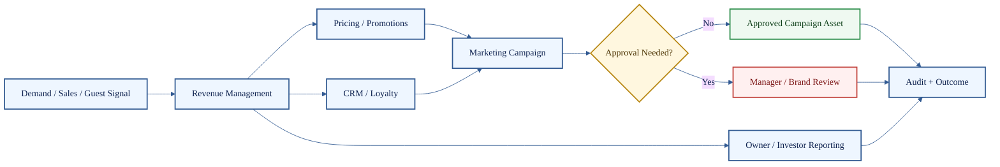

# Revenue, CRM, and Growth Agents

**Cluster count:** 5 agents  
**Domain:** revenue management, pricing, promotions, CRM, loyalty, marketing, and owner reporting.

> [!IMPORTANT]
> Revenue recommendations must distinguish verified operating data from estimates, forecasts, and campaign assumptions.

## Cluster Role

Revenue, CRM, and Growth agents connect operational performance with demand, guest relationships, pricing, promotion design, marketing execution, and ownership reporting.



## Agent Profiles

| # | Agent | What it does | Public-safe inputs | Public-safe outputs | Boundary |
| ---: | --- | --- | --- | --- | --- |
| 47 | Revenue Management Agent | Evaluates revenue performance, demand, yield opportunities, and operating pressure. | Sales, forecast, demand signals, capacity, mix. | Revenue brief, opportunity list, risk summary. | Revenue actions cannot override policy, fairness, or approval. |
| 48 | Pricing / Promotions Agent | Supports discount logic, offer clarity, price tests, and promotional structure. | Price, margin, offer terms, campaign goal. | Promotion draft, pricing recommendation, offer-risk note. | Discounts and claims require accuracy and approval. |
| 49 | CRM / Loyalty Agent | Supports guest segments, retention, loyalty engagement, and campaign targeting. | Loyalty data, segment, consent, visit history. | Segment summary, loyalty action, retention idea. | Must respect privacy, consent, and brand boundaries. |
| 50 | Marketing Campaign Agent | Drafts campaign plans, copy, creative briefs, and channel schedules. | Campaign goal, audience, offer, brand rules. | Campaign outline, copy draft, channel plan. | Publishing requires brand, offer, likeness, and approval checks. |
| 51 | Owner / Investor Reporting Agent | Summarizes operating performance for ownership or executive review. | KPIs, exceptions, forecasts, verified reports. | Owner brief, KPI summary, narrative, exception list. | Must separate verified data from estimates or incomplete signals. |

## Example Use Case

A restaurant wants to promote a slow-moving menu item. Revenue Management checks performance, Pricing/Promotions checks margin and offer clarity, CRM/Loyalty checks appropriate audience targeting, Marketing drafts the campaign, and approval gates decide whether it can publish.

```text
Sales signal -> Revenue review -> Offer design -> CRM targeting -> Campaign draft -> Approval gate -> Audit trace
```

## Quality Standard

A revenue or growth output is credible when it is financially clear, policy-safe, privacy-aware, brand-accurate, and honest about the difference between verified performance and forecasted upside.

[Back to Agent Registry](README.md)
