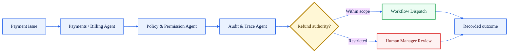

# Systems, Payments, and Devices — 5 Agents

Systems, Payments, and Devices agents sit near the boundary between intelligence and real system control. This cluster requires strict permission, audit, and human review rules because the outputs can affect money, devices, system state, or operational access.

> [!IMPORTANT]
> This is a public capability profile. It is not production adapter logic, not a private integration spec, and not a remote-control implementation.

## Cluster Role

| Responsibility | Meaning |
| --- | --- |
| Integration awareness | Understands the operational role of POS, PMS, KDS, payment, kiosk, and device systems |
| System-state review | Tracks whether external systems are available, stale, degraded, or out of sync |
| Financial caution | Treats payment, refund, billing, and pay-adjacent actions as high-risk |
| Device authority | Requires explicit scope and audit for device, kiosk, screen, or remote-assist actions |
| Offline continuity | Preserves safe operation when cloud, network, or integration paths degrade |

## Agent Profiles

| # | Agent | Primary responsibility | Example inputs | Typical outputs | Governance boundary |
| ---: | --- | --- | --- | --- | --- |
| 52 | POS / PMS / KDS Integration Agent | Maps operational signals from POS, PMS, KDS, reservations, and service systems. | Ticket times, order states, room states, reservation feed, integration health. | Integration status, event map, sync warning, system-context packet. | Observes and routes by default; system control requires explicit authority. |
| 53 | Payments / Billing Agent | Supports billing review, payment issues, refunds, charge checks, and financial exceptions. | Failed payment, refund request, billing discrepancy, chargeback signal. | Payment exception, refund review packet, billing summary, approval route. | Financial actions require strict authorization, audit, and often human approval. |
| 54 | Device Lock / Kiosk Agent | Supports device mode, kiosk state, restricted surfaces, and frontline device control. | Kiosk status, device role, lock request, manager mode request. | Device state, lock/unlock request, kiosk alert, control event. | Device control is high authority and must be logged, scoped, and reversible where possible. |
| 55 | Offline / Edge Sync Agent | Supports degraded operation, local continuity, sync reconciliation, and conflict detection. | Network outage, offline task queue, local state, sync conflict. | Offline status, sync queue, conflict report, recovery summary. | Offline actions must reconcile safely and preserve audit continuity. |
| 56 | Screen Twin / Remote Assist Agent | Supports remote assistance, screen-state understanding, and guided operational help. | Screen context, support request, user permission, workflow state. | Screen context, assist note, recommended click path, remote-support summary. | Remote control or screen access requires permission, consent, and audit boundaries. |

## Example Flow — Refund Review

## Boundary Note

This cluster does not publish live POS/PMS/KDS adapters, payment implementation, kiosk control code, remote-assist controls, credentials, deployment logic, or customer integration rules.

[Back to Agent Registry](README.md) · [Back to Ratio-56](../RATIO_56_HOSPITALITY_AGENT_ARCHITECTURE.md)
