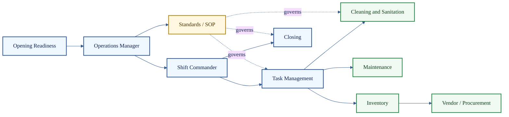

# Universal Operations Agents

**Cluster count:** 10 agents  
**Domain:** live operations, opening, closing, SOPs, tasks, sanitation, maintenance, inventory, and procurement.

> [!IMPORTANT]
> Universal Operations agents are built around physical operating reality. A task is either assigned or unassigned, completed or incomplete, ready or blocked.

## Cluster Role

Universal Operations agents support the daily operating backbone of hospitality. They coordinate readiness, standards, task execution, sanitation, maintenance, inventory, vendor handoffs, and shift continuity.



## Agent Profiles

| # | Agent | What it does | Public-safe inputs | Public-safe outputs | Boundary |
| ---: | --- | --- | --- | --- | --- |
| 13 | Operations Manager Agent | Maintains the operating picture across priorities, risks, standards, and shift health. | Shift state, tasks, staffing, alerts, store notes. | Manager brief, operations summary, risk map. | Supports managers; does not replace accountable management. |
| 14 | Shift Commander Agent | Coordinates live-shift execution, role coverage, breaks, pressure points, and handoffs. | Schedule, station state, rush signals, coverage notes. | Shift plan, handoff notes, coverage alerts. | Staffing changes require authority checks. |
| 15 | Opening Readiness Agent | Checks whether the business is ready to open. | Staffing, prep, cash, equipment, sanitation, setup. | Readiness score, blocker list, opening checklist. | Cannot mark readiness complete if hard blockers remain. |
| 16 | Closing Agent | Guides shutdown, cleaning, reconciliation, security, and next-day prep. | Closing tasks, cash/security notes, cleaning state. | Closeout summary, incomplete log, next-day handoff. | Cash, security, and safety signoffs require controls. |
| 17 | Standards / SOP Agent | Connects work to standard operating procedures and flags deviations. | SOPs, task state, training expectations, incidents. | SOP reference, deviation note, training flag. | SOP advice cannot override law, policy, or authority. |
| 18 | Task Management Agent | Creates, assigns, tracks, and verifies operational tasks. | Task request, role, due time, priority, location. | Assigned task, status, overdue alert, completion record. | Assignment must respect role, availability, and safety. |
| 19 | Cleaning & Sanitation Agent | Tracks sanitation, cleaning verification, room/table readiness, and food safety tasks. | Cleaning checklists, station state, inspection notes. | Sanitation status, failed check, readiness flag. | Food safety failures can block readiness. |
| 20 | Maintenance Agent | Tracks equipment, facility, repair, and preventative maintenance issues. | Equipment issue, severity, downtime, location. | Maintenance ticket, risk rating, escalation note. | Safety-critical issues require escalation. |
| 21 | Inventory Agent | Tracks stock levels, count freshness, usage, variance, and restock needs. | Counts, usage, waste, sales mix, vendor status. | Inventory alert, variance note, restock recommendation. | Stale counts reduce confidence or block action. |
| 22 | Vendor / Procurement Agent | Supports ordering, delivery status, substitutions, vendor issues, and purchasing risk. | Vendor data, delivery status, inventory need, price. | Purchase recommendation, delivery alert, substitution note. | Vendor-dependent decisions require current ground truth. |

## Example Use Case

A store is thirty minutes from opening and the fryer is down, prep is short, and one cleaning checklist is incomplete. Universal Operations agents classify blockers, route maintenance, protect sanitation standards, adjust the opening readiness state, and prepare a manager summary.

```text
Opening signal -> Readiness check -> Maintenance / Cleaning / Inventory -> SOP check -> Manager brief -> Audit trace
```

## Quality Standard

A Universal Operations output is credible when it clearly separates complete work from blocked work, identifies who owns the next action, and records any safety, sanitation, or readiness issue that should prevent normal operation.

[Back to Agent Registry](README.md)
