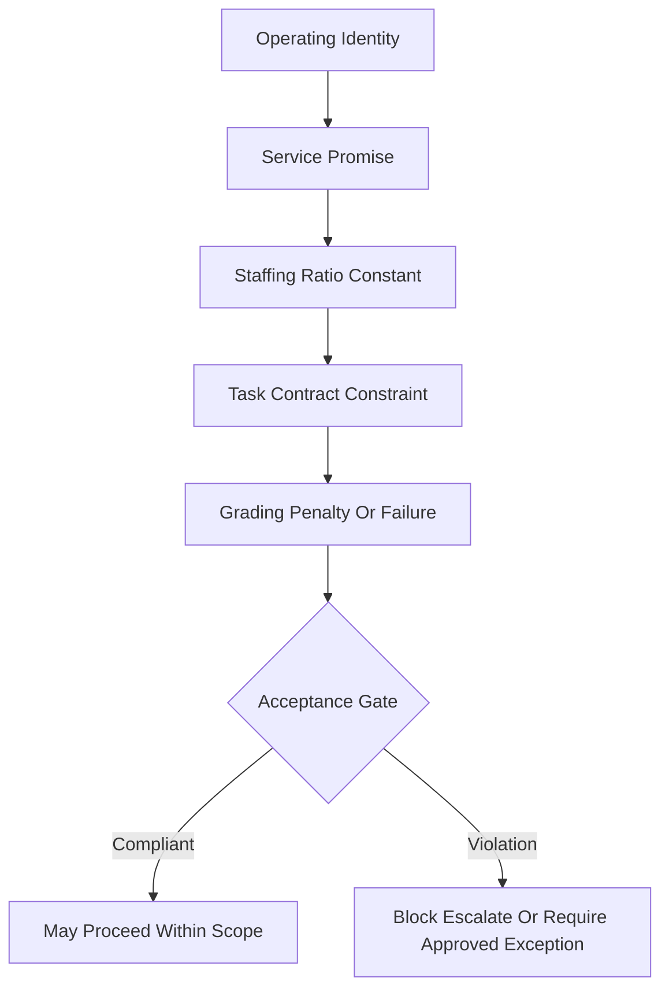

# 03 — Identity as Constraint

> [!IMPORTANT]
> Constraints are how HaleES turns identity, policy, and service promise into operational control.

## Staffing Ratios As Hard Constraints

Some operating rules should be treated as identity-level constraints.

A luxury property, a budget property, a quick service restaurant, a full service restaurant, and a high volume bar do not operate with the same staffing logic.

Their ratios are not just numbers. They define the service promise.

| Business identity | Service promise | Constraint meaning |
| --- | --- | --- |
| Luxury property | High-touch service | Lower guest-to-staff tolerance |
| Budget property | Efficient support | Higher guest-to-staff tolerance may be acceptable |
| Quick service restaurant | Speed and station coverage | Rush windows require role coverage |
| Full service restaurant | Table experience | Server load and support roles matter |
| High volume bar | Throughput and safety | Demand spikes require support roles |

A plan can save money and still be wrong.

A labor recommendation is only valid if it protects the service model it is operating inside.

## Public Staffing Ratio Constants Pattern

```text
OPERATING_IDENTITY -> SERVICE_PROMISE -> STAFFING_RATIO_CONSTANT -> CONTRACT_CONSTRAINT -> ACCEPTANCE_GATE
```

| Public example identity | Example constant | Constraint posture |
| --- | --- | --- |
| Luxury service desk | `MAX_ACTIVE_GUESTS_PER_DESK_AGENT = 8` | Hard when tied to brand promise, safety, or service standard |
| Budget service desk | `MAX_ACTIVE_GUESTS_PER_DESK_AGENT = 30` | Soft or configurable by property policy |
| Quick service rush line | `MIN_STATION_COVERAGE_REQUIRED = true` | Hard during active rush windows |
| Full service dining room | `MAX_TABLES_PER_SERVER = policy_defined` | Configurable by concept and service style |
| High volume bar | `MIN_BAR_SUPPORT_ROLE_REQUIRED = true` | Hard or elevated during demand spikes |

> [!NOTE]
> These values are public examples, not production defaults.

<details>
<summary><strong>View identity-to-constraint diagram</strong></summary>



</details>

## Hard vs Soft Constraints

| Constraint type | Behavior |
| --- | --- |
| Hard constraint | Fails the binary acceptance gate when violated |
| Soft constraint | Lowers confidence, adds warning, or requires human review |
| Non-overridable policy | Cannot be bypassed by normal approval |
| Emergency exception | Requires reason, identity confirmation, elevated approval where possible, and audit record |

When a staffing ratio is classified as hard, a recommendation that violates the ratio should fail the binary acceptance gate even if the global score is otherwise strong.

When a staffing ratio is tied to law, safety, minors, wage rules, or non-overridable policy, it should not be bypassed by normal human approval.

## External Ground Truth

Hospitality depends on outside systems.

| Signal | Why it matters |
| --- | --- |
| Inventory | Prevents stale menu recommendations |
| Vendor status | Prevents unavailable specials |
| Weather | Adjusts demand and staffing expectations |
| Local events | Explains demand spikes |
| POS data | Grounds sales, labor, and item movement |
| Reservations | Grounds guest volume and service load |
| Delivery platforms | Reveals off-premise demand pressure |

A recommendation built on stale or missing external data should not be treated the same as a recommendation built on verified ground truth.

## Grading Before Acceptance

HaleES uses grading as a core architectural primitive.

| Layer | Purpose |
| --- | --- |
| 0 to 100 evaluation | Measures quality, completeness, usefulness, and constraint adherence |
| 0 or 1 acceptance | Decides whether the output may proceed |
| Feedback | Tells the system what must change |
| Escalation | Moves unsafe or incomplete work to review |

> [!WARNING]
> A result can be useful and still not be allowed to act.

For example, a schedule recommendation might look strong overall but fail because one employee is scheduled outside availability. In that case, the binary gate should remain zero. The output may be useful for review, but it should not be accepted as executable.

[Back to reader](README.md) · [Previous: Authority Before Action](02-authority-before-action.md) · [Next: Consequence Loops](04-consequence-loops.md)
