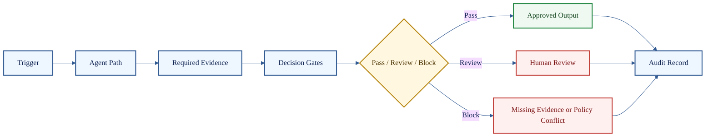

# HaleES Public Workflow Blueprints

**Hospitality workflows that show how HaleES-56 routes work through evidence, authority, approval, and audit.**

> [!IMPORTANT]
> These are public workflow blueprints. They are not private HaleES runtime logic, internal prompts, production tool routes, live integrations, customer data, or proprietary scoring weights.

## Blueprint Index

| Workflow | File | Public purpose |
| --- | --- | --- |
| Call-Off Coverage | [call-off-coverage.md](call-off-coverage.md) | Build a same-day coverage plan without auto-changing the schedule |
| Labor Cut Review | [labor-cut-review.md](labor-cut-review.md) | Block or review labor reductions that violate service coverage |
| Guest Recovery | [guest-recovery.md](guest-recovery.md) | Route complaints through recovery, policy, escalation, and audit |
| Stale Inventory Prep | [stale-inventory-prep.md](stale-inventory-prep.md) | Stop prep decisions when source evidence is stale |
| Refund Review | [refund-review.md](refund-review.md) | Route payment/refund requests through authority and audit gates |
| KDS Bottleneck Review | [kds-bottleneck-review.md](kds-bottleneck-review.md) | Convert ticket-time pressure into an operational bottleneck review |
| Payroll / Tip Exception | [payroll-tip-exception.md](payroll-tip-exception.md) | Route pay-impacting exceptions to controlled review |
| Offline Sync Reconciliation | [offline-sync-reconciliation.md](offline-sync-reconciliation.md) | Preserve safe operation during degraded connectivity |

## Shared Workflow Shape

## Public Boundary

| Public here | Closed in HaleES production |
| --- | --- |
| Workflow trigger | Private event routing implementation |
| Agent path | Internal prompts and orchestration logic |
| Required evidence | Live data adapters and customer-specific policies |
| Decision gates | Proprietary scoring weights and grader implementation |
| Expected output | Production execution engine |
| Audit record shape | Hosted infrastructure and private telemetry |

[Back to README](../README.md)
