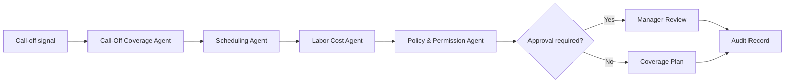

# Call-Off Coverage Workflow

Create a same-day coverage plan for an uncovered shift without automatically changing the schedule or contacting employees.

> [!IMPORTANT]
> This is a public workflow blueprint. It does not include private scheduling logic, employee ranking logic, outreach automation, or production approval rules.

## Trigger

Employee call-off, no-show, missed shift, or manager-created absence signal.

## Agent Path

```text
Call-Off Coverage Agent -> Scheduling Agent -> Labor Cost Agent -> Policy & Permission Agent -> Communications Agent -> Audit & Trace Agent
```

## Required Evidence

| Evidence | Why it matters |
| --- | --- |
| Current schedule | Identifies uncovered role and time window |
| Role qualifications | Prevents assigning unqualified coverage |
| Employee availability | Prevents unavailable outreach |
| Overtime state | Protects labor rules and cost exposure |
| Contact permission | Determines whether outreach can be sent |
| Manager approval rule | Determines whether the plan can move beyond recommendation |

## Decision Gates

| Gate | Pass condition | Review/block condition |
| --- | --- | --- |
| Coverage eligibility | Candidate is available and qualified | Missing qualification or unavailable |
| Labor risk | No prohibited overtime or labor conflict | Overtime or labor rule conflict |
| Contact authority | Outreach is permitted | Outreach requires manager approval |
| Schedule authority | Manager approves change | No schedule mutation allowed |

## Expected Output

| Output | Description |
| --- | --- |
| Coverage summary | Who is missing, when, and what role is uncovered |
| Ranked options | Public-safe replacement options and constraints |
| Outreach draft | Message draft for approved manager use |
| Approval packet | What the manager must approve before action |
| Audit record | Signal, actor, decision, reason, and result |

## Public Flow



## Closed Boundary

This blueprint does not publish private ranking logic, live schedule mutation, employee contact automation, labor optimization weights, or customer-specific labor rules.

[Back to workflows](README.md)
