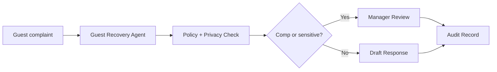

# Guest Recovery Workflow

Route a guest complaint through recovery planning, policy review, escalation, and audit.

> [!IMPORTANT]
> This public blueprint does not publish private guest data, compensation thresholds, brand-specific policies, or production messaging logic.

## Trigger

Guest complaint, bad review, service failure, refund request, VIP concern, or manager-created recovery case.

## Agent Path

```text
Guest Recovery Agent -> Guest Personalization Agent -> Policy & Permission Agent -> Communications Agent -> Escalation Agent -> Audit & Trace Agent
```

## Required Evidence

| Evidence | Why it matters |
| --- | --- |
| Complaint summary | Captures issue, tone, and urgency |
| Service context | Shows what happened and when |
| Guest status | Identifies VIP or high-sensitivity handling needs |
| Compensation policy | Defines what can be offered |
| Privacy boundary | Limits what context can be used |
| Manager approval rule | Determines whether the response can be sent or offered |

## Decision Gates

| Gate | Pass condition | Review/block condition |
| --- | --- | --- |
| Privacy gate | Only minimum necessary context is used | Private or unnecessary context is exposed |
| Compensation gate | Recovery option is within allowed scope | Refund, comp, or exception requires review |
| Brand-risk gate | Message is safe and on-brand | Public, legal, or reputational risk is present |
| Escalation gate | Case is normal service recovery | VIP, safety, legal, or severe complaint requires escalation |

## Expected Output

| Output | Description |
| --- | --- |
| Recovery summary | What failed and what the guest needs |
| Recovery options | Public-safe options with approval requirements |
| Draft response | Message draft, not automatic send |
| Escalation reason | Why manager review is needed, if triggered |
| Audit record | Complaint, actor, decision, output, and result |

## Public Flow



## Closed Boundary

This blueprint does not publish guest data, compensation thresholds, internal message prompts, brand-specific recovery rules, or production communication dispatch.

[Back to workflows](README.md)
