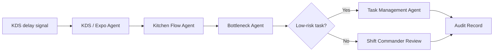

# KDS Bottleneck Review Workflow

Convert ticket-time pressure, expo congestion, or station overload into a structured bottleneck review.

> [!IMPORTANT]
> This public blueprint does not publish live KDS adapter code, proprietary station scoring, store-specific thresholds, or production dispatch logic.

## Trigger

Ticket times rise above target, order queue backs up, expo reports congestion, or a kitchen station becomes overloaded.

## Agent Path

```text
KDS / Expo Agent -> Kitchen Flow Agent -> Bottleneck Agent -> Shift Commander Agent -> Task Management Agent -> Audit & Trace Agent
```

## Required Evidence

| Evidence | Why it matters |
| --- | --- |
| Ticket-time signal | Shows where service pressure is increasing |
| Station load | Identifies which station is constrained |
| Order volume | Distinguishes normal rush from abnormal failure |
| Staffing map | Shows whether role movement is possible |
| Menu mix | Identifies whether specific items are causing pressure |
| Manager approval rule | Determines whether station or staffing changes require review |

## Decision Gates

| Gate | Pass condition | Review/block condition |
| --- | --- | --- |
| Signal confidence | KDS/expo signal is current and clear | Missing, stale, or noisy data |
| Station impact | Bottleneck can be identified | Cause is unclear or conflicting |
| Intervention authority | Task routing is low risk | Staffing or station reassignment needs review |
| Service risk | Intervention reduces pressure | Intervention could worsen service or safety |

## Expected Output

| Output | Description |
| --- | --- |
| Bottleneck summary | What is slow, where, and why it likely matters |
| Impact note | Guest wait, ticket timing, and station pressure |
| Recommended mitigation | Task, handoff, expo, or manager review action |
| Audit record | Signal, decision, reason, and outcome |

## Public Flow



## Closed Boundary

This blueprint does not publish KDS integrations, station scoring, menu-specific thresholds, live kitchen dispatch, or customer operating data.

[Back to workflows](README.md)
