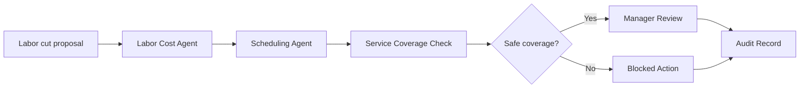

# Labor Cut Review Workflow

Review a labor-reduction recommendation before it can affect service coverage.

> [!IMPORTANT]
> This public blueprint shows the governance shape only. It does not publish private labor scoring, proprietary staffing-ratio constants, or production schedule controls.

## Trigger

A manager, forecast, or labor-cost signal proposes reducing labor.

## Agent Path

```text
Labor Cost Agent -> Scheduling Agent -> Shift Commander Agent -> Policy & Permission Agent -> Grading / QA Agent -> Audit & Trace Agent
```

## Required Evidence

| Evidence | Why it matters |
| --- | --- |
| Current schedule | Shows who is currently covering each role |
| Forecast demand | Shows expected pressure after the cut |
| Role coverage | Identifies whether required stations remain staffed |
| Service standard | Defines minimum acceptable coverage |
| Labor target | Explains financial pressure |
| Manager authority | Determines who can approve the change |

## Decision Gates

| Gate | Pass condition | Review/block condition |
| --- | --- | --- |
| Coverage gate | Required roles remain covered | Role or station drops below required coverage |
| Service-ratio gate | Cut stays above required service ratio | Cut violates service ratio or guest experience threshold |
| Labor-risk gate | Savings do not create unsafe operating pressure | Financially useful but operationally unsafe |
| Approval gate | Authorized manager approves | No approval or insufficient authority |

## Expected Output

| Output | Description |
| --- | --- |
| Labor impact summary | Cost savings and service risk side by side |
| Coverage map | Role-by-role impact of the proposed cut |
| Recommendation | Approve, revise, or block |
| Block reason | Clear explanation when the cut fails |
| Audit record | Actor, signal, decision, reason, and result |

## Public Flow



## Closed Boundary

This blueprint does not publish proprietary labor weights, private staffing constants, customer-specific schedules, or production labor-control code.

[Back to workflows](README.md)
