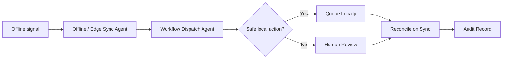

# Offline Sync Reconciliation Workflow

Preserve safe operation during degraded connectivity, then reconcile queued work when systems return.

> [!IMPORTANT]
> This public blueprint does not publish offline runtime internals, sync algorithms, conflict-resolution code, or production data stores.

## Trigger

Network outage, cloud service degradation, POS/KDS sync failure, local queue buildup, or offline operating mode.

## Agent Path

```text
Offline / Edge Sync Agent -> Workflow Dispatch Agent -> Audit & Trace Agent -> POS / PMS / KDS Integration Agent -> Human Manager Review when needed
```

## Required Evidence

| Evidence | Why it matters |
| --- | --- |
| Local state | Shows what happened while offline |
| Sync queue | Shows pending actions waiting for reconciliation |
| Conflict state | Identifies conflicting updates |
| Risk class | Determines which actions can stay local |
| Audit continuity | Preserves traceability across offline and online phases |
| Review threshold | Determines when human review is required |

## Decision Gates

| Gate | Pass condition | Review/block condition |
| --- | --- | --- |
| Offline safety gate | Action is safe to queue locally | Financial, pay, safety, or high-risk action requires review |
| Conflict gate | No conflicting state is found | Conflicting local and remote records exist |
| Evidence gate | Local event has enough detail | Missing actor, time, reason, or source state |
| Reconciliation gate | Sync can complete cleanly | Manual review required before finalization |

## Expected Output

| Output | Description |
| --- | --- |
| Offline status | What is degraded and what remains safe |
| Queue summary | Pending actions and risk classes |
| Conflict report | Items needing reconciliation review |
| Reconciliation result | Synced, reviewed, blocked, or pending |
| Audit record | Offline event, actor, queue state, decision, and outcome |

## Public Flow



## Closed Boundary

This blueprint does not publish offline execution internals, conflict-resolution algorithms, production queue code, customer data stores, or sync infrastructure.

[Back to workflows](README.md)
