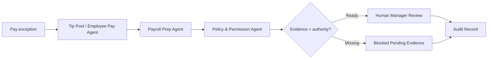

# Payroll / Tip Exception Workflow

Route payroll, timecard, tip-pool, or employee-pay exceptions through controlled review before any pay-impacting action.

> [!IMPORTANT]
> This public blueprint does not publish payroll integrations, wage rules, tip formulas, employee data, or production pay-correction logic.

## Trigger

Timecard mismatch, missing punch, tip-pool discrepancy, payroll exception, employee pay question, or manager-created pay review.

## Agent Path

```text
Tip Pool / Employee Pay Agent -> Payroll Prep Agent -> Policy & Permission Agent -> Audit & Trace Agent -> Human Manager Review
```

## Required Evidence

| Evidence | Why it matters |
| --- | --- |
| Timecard record | Shows hours and punch state |
| Tip or pay record | Shows the pay-impacting source data |
| Policy reference | Defines how the exception should be handled |
| Actor role | Determines who can review or approve |
| Employee context boundary | Protects sensitive employee data |
| Approval record | Preserves accountability before pay-impacting change |

## Decision Gates

| Gate | Pass condition | Review/block condition |
| --- | --- | --- |
| Evidence gate | Time/pay source data is present | Missing or conflicting records |
| Authority gate | Actor is authorized to review | Actor lacks pay authority |
| Privacy gate | Only necessary employee context is used | Excess or unauthorized employee data is present |
| Approval gate | Authorized approval is captured | No approval for pay-impacting action |

## Expected Output

| Output | Description |
| --- | --- |
| Exception packet | Summary of issue, source records, and affected period |
| Review route | Manager, payroll admin, or owner review path |
| Missing evidence list | Records needed before decision |
| Audit record | Actor, reason, source state, decision, and outcome |

## Public Flow



## Closed Boundary

This blueprint does not publish payroll adapters, wage calculations, tip-pool formulas, employee records, or production pay authorization logic.

[Back to workflows](README.md)
