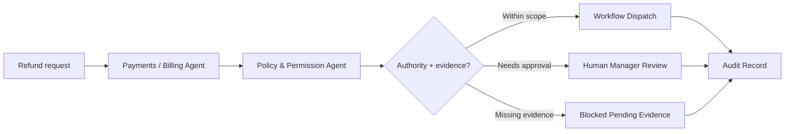

# Refund Review Workflow

Route refund, void, billing correction, or payment exception requests through authority and audit before action.

> [!IMPORTANT]
> This public blueprint does not publish payment adapter code, refund thresholds, processor logic, customer transaction data, or production approval rules.

## Trigger

Refund request, billing dispute, void request, failed payment, chargeback signal, or manager-created payment exception.

## Agent Path

```text
Payments / Billing Agent -> Policy & Permission Agent -> Audit & Trace Agent -> Workflow Dispatch Agent or Human Manager Review
```

## Required Evidence

| Evidence | Why it matters |
| --- | --- |
| Transaction record | Confirms the payment exists and identifies amount |
| Refund reason | Explains why money movement is requested |
| Actor role | Determines authority to approve or request action |
| Approval threshold | Determines whether manager review is required |
| Guest/service context | Supports the refund rationale |
| Audit requirement | Ensures financial action is traceable |

## Decision Gates

| Gate | Pass condition | Review/block condition |
| --- | --- | --- |
| Transaction gate | Transaction exists and matches request | Missing, disputed, or mismatched transaction |
| Authority gate | Actor has approval authority | Actor can only request review |
| Amount gate | Amount is within allowed range | Amount exceeds threshold |
| Evidence gate | Reason and support are sufficient | Missing explanation or proof |

## Expected Output

| Output | Description |
| --- | --- |
| Refund review packet | Summary of request, amount, reason, and authority path |
| Decision route | Pass, review, or block |
| Approval note | What a manager must approve |
| Audit record | Actor, transaction reference, reason, decision, and outcome |

## Public Flow



## Closed Boundary

This blueprint does not publish processor integrations, refund automation, private thresholds, financial credentials, or live payment workflow code.

[Back to workflows](README.md)
