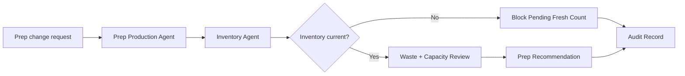

# Stale Inventory Prep Workflow

Stop prep-production changes when inventory evidence is stale, missing, or unreliable.

> [!IMPORTANT]
> This public blueprint shows the evidence gate. It does not publish private prep forecasting logic, recipe costing logic, inventory adapters, or production pars.

## Trigger

Prep sheet adjustment, par change, shortage warning, overproduction risk, or inventory-dependent production decision.

## Agent Path

```text
Prep Production Agent -> Inventory Agent -> Waste / Variance Agent -> Kitchen Flow Agent -> Grading / QA Agent -> Audit & Trace Agent
```

## Required Evidence

| Evidence | Why it matters |
| --- | --- |
| Current inventory count | Prevents acting on stale stock assumptions |
| Forecast demand | Grounds prep in expected service pressure |
| Prep par | Defines normal production target |
| Waste trend | Prevents overproduction and variance drift |
| Shelf-life rule | Protects quality and food safety |
| Kitchen capacity | Confirms the team can execute the prep plan |

## Decision Gates

| Gate | Pass condition | Review/block condition |
| --- | --- | --- |
| Inventory freshness | Count is current enough for action | Count is stale, missing, or disputed |
| Waste-risk gate | Plan does not increase likely waste beyond limit | Overproduction or shelf-life risk is high |
| Capacity gate | Kitchen can execute the prep change | Station pressure or staffing blocks execution |
| QA gate | Recommendation has evidence and clear output | Recommendation is incomplete or unsupported |

## Expected Output

| Output | Description |
| --- | --- |
| Prep recommendation | Proposed adjustment with evidence notes |
| Evidence status | Current, stale, missing, or disputed |
| Waste-risk note | Risk of overproduction or shortage |
| Block reason | Clear reason when prep change cannot proceed |
| Audit record | Signal, evidence state, decision, reason, and result |

## Public Flow



## Closed Boundary

This blueprint does not publish private demand forecasting, inventory adapter logic, store-specific pars, recipe economics, or production prep algorithms.

[Back to workflows](README.md)
